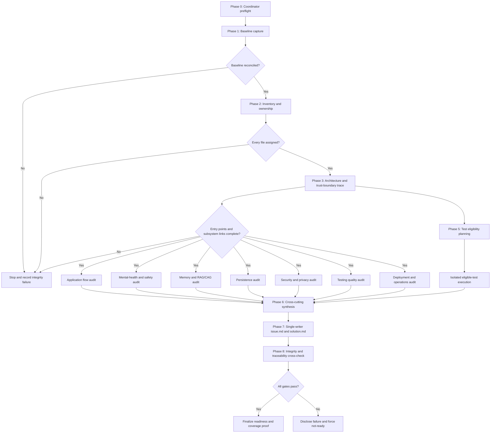
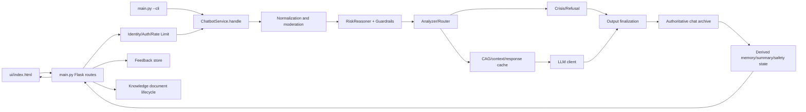

# Technical Design Document

## Overview

This design defines the proposed execution architecture for a complete, evidence-based audit of the Soulene RAG implementation. It converts the approved requirements into a phased pipeline that captures a frozen, tamper-evident baseline, inventories every file, traces behavior end to end, assigns non-overlapping subsystem ownership, evaluates existing tests in isolation, synthesizes current defects and future risks, produces only `issue.md` and `solution.md` at the repository root, and verifies repository integrity before completion. The audit tooling described below is to be created as findings-local audit infrastructure; it is not existing application functionality.

The audit target is `c:\Users\abhin\OneDrive\Desktop\Soulene AI-Rag\New folder\Soulene_Rag_Implementation`. “Read-only” means protected-baseline read-only: no audit command may modify a file that existed at baseline. The only audit writes are permitted findings-local artifacts, isolated sandbox side effects, and the two lowercase root deliverables. All intermediate files, copied code, generated harnesses, logs, and test side effects are confined to `.kiro/specs/complete-codebase-audit-future-risk-analysis/findings/<run-id>/`. The final report writer is the only component allowed to create or update the two newly created root deliverables during its bounded publication transaction; it must never overwrite deliverables that existed at baseline.

### Goals

- Account for every baseline file, including hidden, generated, binary, data, environment, and version-control files.
- Establish architecture and trust-boundary evidence before judging subsystem behavior.
- Audit application flow, mental-health safety, multi-turn safety, memory, CAG, persistence, security, privacy, dependencies, testing, and operations.
- Separate repository-proven, test-observed, inferred, and externally unverified behavior.
- Separate current defects, future risks, and combined current-and-future findings.
- Execute only pre-classified eligible existing tests, using baseline code in an isolated, network-denied environment.
- Make coverage, exclusions, conflicts, integrity, and production-readiness decisions mechanically reconcilable.

### Non-Goals

- Modifying, formatting, repairing, migrating, or deleting application or repository content.
- Connecting to production, live OpenAI, MongoDB, or other external services.
- Treating historical `Issues.md`, `Solutions.md`, `Test_Report.md`, or audit JSON as authoritative.
- Claiming runtime behavior that is not supported by repository evidence or isolated observations.
- Implementing any remediation proposed in `solution.md`.

### Research Findings Informing the Design

Repository-local research was used instead of external sources because the authoritative subject is the baseline itself. The following are design inputs, not completed audit findings:

- `main.py` exposes the WSGI `app`, Flask UI/API routes, direct development startup, and `--cli`; `build_cache.py::main` is a separate executable that can write the root `cache/` tree. Route tracing must include identity, sessions, account deletion, documents, feedback, metrics, JSON chat, buffered SSE, and health rather than relying only on the module docstring.
- Request guarding is conditional: identity parsing precedes optional API/admin authentication, deleted-user checks can initialize storage before rate limiting, `/` is open but rate-limited, and `/health` bypasses the guard yet calls `get_service()` and archive readiness. Flask, CLI, Gunicorn import warm-up, first-request lazy initialization, and health-triggered initialization are distinct startup variants.
- `ChatbotService.handle` rehydrates authoritative history, drains pending secondary work, checks idempotency, mutates process-local risk state and analyzer counters, selects crisis/refusal/cache/model behavior, finalizes output, commits the authoritative turn, and only then updates transcript caches, derived memory, summary, and durable safety state. The pre-commit in-memory mutations and post-commit durable updates must be audited separately under generation/archive failures and retry.
- Deterministic guardrails form the current-turn safety floor; the semantic reasoner fuses history and prior state and fails back to that floor. Crisis precedes refusal/cache/model, while crisis, refusal, cached, and generated replies all pass output finalization. The optional second model output reviewer defaults off, so disagreement, malformed output, stale state, step-down, and final-controller behavior are central audit subjects.
- Active knowledge behavior is lexical CAG, not vector retrieval. `ContextCache` and `ResponseCache` are process-local; `KnowledgeCache` persists JSON under root `cache/`; documents live under root `knowledge/`. SQLite and Mongo are the only runtime-selectable authoritative backends. JSON archive and legacy/base memory implementations remain inventory/audit subjects but must not be presented as selectable production alternatives without evidence.
- `pytest.ini` discovers `tests/`, while root `test_all.py`, root `test_audit.py`, smoke modules, and script-style `__main__` entry points need separate ledger entries. Live smoke scripts make real model calls and can persist storage/cache state; the opt-in Mongo suite connects to a real replica set, spawns processes, writes collections, and drops a generated database. `tests/test_api.py` uses a fake LLM but still loads environment-selected storage and writes knowledge/cache/data paths, so it is eligible only with verified sandbox redirection.
- `render.yaml` runs two Gunicorn workers with four threads each, selects Mongo, disables the optional model output review, and mounts only `data/`; active `knowledge/` and `cache/` paths are not covered by that mount. `_service`, `_feedback`, rate limiting, context/response caches, turn locks, warm state, and document refresh/invalidation are process-local, creating explicit restart, cross-worker staleness, shared-cache-write, and deployment-path audit variants.
- No explicit application shutdown/client-close lifecycle is evident from the inspected entry-point code. Startup, health, rolling deploy, worker termination, and connection cleanup therefore require trace evidence or an unresolved-path limitation.
- `requirements.txt` pins runtime dependencies, so dependency analysis must compare imports, declared versions, runtime assumptions, and externally verified advisories without transmitting repository data.

### Design Decisions

1. **Baseline before workers:** no architecture inspection, historical report review, or test execution starts until baseline capture and reconciliation succeed.
2. **Read-only live tree:** the live repository is accessed only by read-only inventory and inspection operations. Any command with possible side effects runs against a findings-local copy.
3. **Evidence as typed records:** workers emit structured records rather than prose, enabling deduplication, traceability, and integrity checks.
4. **Single-writer reports:** subsystem workers never write root reports; one final reporter owns both deliverables.
5. **Safety gets an independent lane:** mental-health and multi-turn analysis has its own scenario matrix, control trace, harm taxonomy, and conflict checks.
6. **Fail closed on audit integrity:** any protected-file mismatch, coverage mismatch, unredacted secret, or output-boundary violation makes production readiness `not-ready`.
7. **Properties are limited to pure audit validators:** the live audit remains an I/O-heavy, one-shot workflow verified by schema, reconciliation, example, integration, isolation, and integrity checks. Property-based testing applies only to deterministic validation of generated manifests, records, path sets, reference graphs, redaction results, and readiness inputs; it never executes against or mutates the target repository.
## Architecture

### Audit Pipeline



### Dependency Gates

| Gate | Required evidence | Unlocks |
|---|---|---|
| G0 Preflight | repository root identity; output paths; no unauthorized lowercase deliverables; findings path policy | baseline capture |
| G1 Baseline | complete file enumeration; SHA-256 for regular files; stable metadata; baseline count; baseline artifact self-check | inventory |
| G2 Inventory | one disposition and one primary owner per baseline file; sensitivity flag; counts reconcile | architecture trace |
| G3 Architecture | entry-point catalog; call/data graph; trust boundaries; backend variants; unresolved-path list | subsystem audits and tests |
| G4 Subsystems | seven uniquely owned worker artifacts validate against schema | synthesis |
| G5 Tests | every existing test classified; eligible tests executed or execution failure recorded; raw output redacted | synthesis |
| G6 Synthesis | normalized and deduplicated findings; conflict resolution; future-risk analysis; readiness draft | reports |
| G7 Reports | both reports generated; finding/remediation references reconcile; report schemas complete | final integrity |
| G8 Integrity | protected hashes/metadata unchanged; created-file allowlist exact; inventory and report cross-links complete | completion |

A failed gate does not get bypassed. The coordinator emits a bounded failure record under `findings/`, skips dependent phases, and ensures any final readiness conclusion is `not-ready` when integrity is affected.

### Audit-Time Filesystem Boundary

```text
Repository_Root/
├── issue.md                         # final writer only
├── solution.md                      # final writer only
├── [all baseline files]             # read-only/protected
└── .kiro/specs/complete-codebase-audit-future-risk-analysis/findings/
    └── <run-id>/
        ├── control/
        ├── baseline/
        ├── inventory/
        ├── architecture/
        ├── subsystem/
        ├── tests/
        ├── synthesis/
        ├── integrity/
        └── sandbox/                 # all copied code and dynamic side effects
```

The baseline is captured before the run directory contains files. The baseline manifest therefore represents the pre-audit file set. Later integrity comparison allows only the two exact lowercase root deliverables and descendants of the run's findings directory as newly created files. If lowercase deliverables already exist at preflight, they are protected baseline artifacts and the audit must stop rather than overwrite them unless the contract explicitly defines a new run policy.

### Baseline and Integrity Algorithm

1. Walk the repository without following symlink/reparse-point targets outside the root.
2. Normalize each relative path to a canonical, case-aware representation and reject path collisions.
3. For each regular file, record SHA-256, byte size, stable timestamps, attributes/mode, file kind, and sensitivity-by-path classification. Hash bytes without parsing or logging them.
4. For links or special entries, record link text/type and stable metadata without dereferencing unsafe targets.
5. Record empty directories only in a directory manifest; inventory reconciliation is file-based as required.
6. Write the manifest atomically inside the findings run directory, then verify the serialized record count and manifest digest.
7. At completion, repeat the same scan for every baseline path and compare content hash and stable metadata. Access time is never deliberately changed or used as the sole integrity signal; any platform-observable protected metadata change is still disclosed.
8. Compute `created = final_paths - baseline_paths` and require every created path to match the exact allowlist.
9. Compute `missing = baseline_paths - final_paths` and require it to be empty.
10. Any mismatch creates an audit-integrity finding, invalidates affected test evidence, and forces `not-ready`.

### Repository Architecture Trace Model

The architecture tracer starts from concrete repository entry points and follows applicable stages rather than assuming one universal path:



Each edge records source, destination, callable/symbol, data classification, validation, authorization, failure behavior, side-effect boundary, and evidence status. SQLite and Mongo are separate selectable runtime variants; present-but-unselected JSON/legacy implementations are traced as compatibility, test, migration, or dead-code candidates rather than assumed production backends. Web, SSE, CLI, document management, feedback, session/account deletion, `build_cache.py`, tests, Flask development, Gunicorn warm/lazy initialization, `/health` readiness, and Render deployment are separate entry-point families.

The trace model distinguishes three safety-state boundaries inside `ChatbotService.handle`: (1) authoritative archive rehydration and pending-secondary convergence; (2) pre-commit process-local risk/counter mutation used to choose the response; and (3) post-commit transcript cache, memory, summary, and durable safety-state completion. Failure edges must show whether pre-commit mutations are cleared, overwritten by rehydration, or can influence a retry after generation or archive failure.

Multi-process deployment is modeled explicitly rather than as a generic stateful variant. For each Gunicorn worker, the trace covers `_service`, `_feedback`, `RateLimiter`, context and response caches, per-turn locks, warm state, document objects, and invalidation state. Cross-worker document upload/delete visibility, shared `KnowledgeCache` temporary-file replacement, ephemeral `knowledge/` and `cache/` paths, and restart behavior are separate operations-risk scenarios.

### Runtime Variant Matrix

| Family | Required variants and audit focus |
|---|---|
| Startup/readiness | Flask direct start, CLI, Gunicorn import warm-up, first-request lazy start, `/health` initialization; missing API key, unavailable Mongo/non-replica-set, warm-cache failure, absent shutdown evidence |
| Request boundary | open index, guarded JSON/SSE chat, metrics, identity/session/account routes, document admin routes, feedback; identity/auth/revocation/rate ordering and clean error disclosure |
| Chat safety/commit | deterministic-only versus semantic fusion, model output reviewer on/off, crisis/refusal/cache/model precedence, generation failure, archive failure, duplicate request, secondary persistence retry |
| Knowledge | build-cache stats/build, upload save→refresh, delete in-memory→unlink, cache hit/miss/invalidation, cross-worker visibility, restart with ephemeral knowledge/cache paths |
| Persistence | SQLite and Mongo authoritative paths; feedback lazy initialization; present-but-unselected JSON/legacy implementations; partial account/session deletion and backend failure semantics |
| Deployment | one process versus two workers/four threads, mounted `data/` versus unmounted `knowledge/`/`cache/`, rolling restart, connection/resource cleanup evidence |

### Subsystem Ownership

Every inventory record receives exactly one primary audit owner and zero or more secondary consumers. Most-specific path rules win over broad rules; ambiguous records are resolved during G2 rather than duplicated.

| Primary owner | Principal scope | Secondary consumers |
|---|---|---|
| Application flow | `main.py`, `ui/`, `app/chatbot/`, `app/normalize.py`, `app/types.py`, `app/utils.py` | safety, security, persistence, testing |
| Safety | `app/safety/`, `app/prompts/`, safety-sensitive orchestration symbols | application flow, testing, security/privacy |
| Memory and RAG/CAG | `app/cag/`, `app/memory/`, `build_cache.py`, `knowledge/`, `cache/` | safety, persistence, operations |
| Persistence | `app/storage/`, database/profile/archive artifacts under `data/`, persistence portions of memory backends | security/privacy, testing, operations |
| Security and privacy | `app/security.py`, `app/identity.py`, `.env*`, security-relevant Git/config evidence | all owners as secondary consumers |
| Testing quality | `tests/`, `test_all.py`, `test_audit.py`, `pytest.ini`, test caches/reports | each tested subsystem |
| Deployment and operations | `render.yaml`, `Procfile`, `requirements.txt`, README/developer docs, `.vscode/`, operational/generated artifacts | security, testing, application flow |

Version-control internals are primarily owned by security/privacy for history and secret-exposure analysis, with metadata-only or structure-only disposition where content review is not meaningful. Historical reports are primarily owned by testing quality but marked untrusted and verified independently before contributing candidate findings.
## Components and Interfaces

### 1. Audit Coordinator

Owns run identity, gate state, worker scheduling, path policy, artifact registry, and stop conditions.

```python
class AuditCoordinator:
    def preflight(root: Path, findings_root: Path) -> RunContext: ...
    def require_gate(gate: GateName) -> None: ...
    def register_artifact(artifact: ArtifactRef) -> None: ...
    def schedule(worker: WorkerSpec) -> WorkerResult: ...
    def fail_closed(reason: str, evidence: EvidenceRef) -> None: ...
```

It launches only dependency-ready workers, gives each worker a unique artifact path, and rejects attempts to target protected paths. Parallelism is permitted only across the seven post-architecture subsystem workers; baseline, inventory, architecture, synthesis, report writing, and final integrity remain serialized.

### 2. Baseline Manager

Produces the immutable baseline and final comparison. It never parses sensitive content while hashing and never excludes a file because it is hidden, ignored, binary, large, cached, or version-controlled.

```python
class BaselineManager:
    def capture(root: Path) -> BaselineManifest: ...
    def compare(manifest: BaselineManifest, allowlist: OutputAllowlist) -> IntegrityResult: ...
```

### 3. Inventory Builder

Enriches every baseline file with type, size, sensitivity, relevance, disposition, owner, secondary consumers, inspection limit, and evidence references. Disposition selection is deterministic:

- `content-reviewed`: readable source, tests, configuration, documentation, structured text, or safely redacted sensitive configuration.
- `structure-reviewed`: databases, PDFs, spreadsheets, archives, and other formats where schema/pages/sheets/container structure can be inspected safely.
- `metadata-reviewed`: bytecode, cache internals, opaque Git objects, images, pack files, and artifacts where only provenance/type/size/hash is meaningful.
- `excluded-with-reason`: inaccessible, corrupt, unsupported, or unsafe-to-open files; a specific reason and compensating evidence are mandatory.

The inventory gate requires `inventory_count == baseline_file_count`, unique canonical paths, one disposition, and one primary owner per file.

### 4. Architecture Tracer

Builds entry-point, component, interface, data-flow, trust-boundary, backend, failure-propagation, and unresolved-path tables. Static evidence uses file/symbol/line references. Runtime claims are labeled separately and require isolated test evidence.

```python
class ArchitectureTracer:
    def discover_entry_points(inventory: Inventory) -> list[EntryPoint]: ...
    def trace(entry: EntryPoint, variant: BackendVariant) -> list[TraceEdge]: ...
    def reconcile_subsystems(edges: list[TraceEdge]) -> CoverageResult: ...
```

A subsystem must have an upstream source and downstream effect or be explicitly labeled isolated. Optional configurations such as SQLite/Mongo, semantic safety enabled/disabled, output safety reviewer enabled/disabled, authenticated/unauthenticated routes, cache hit/miss, and web/CLI/SSE are modeled as variants.

### 5. Evidence and Redaction Service

All workers submit evidence through one sanitizer. Secret-like values, cookie/token material, connection strings, user content, health data, and database values are replaced with typed descriptors such as `[REDACTED API KEY at .env:<key>]`. The service permits path, symbol, line range, hash prefix where safe, behavior summary, trace edge, and redacted test output.

```python
class EvidenceService:
    def cite(location: Location, observation: str, status: EvidenceStatus) -> Evidence: ...
    def redact(text: str, source_class: DataClass) -> RedactedText: ...
    def validate_no_sensitive_value(record: object) -> ValidationResult: ...
```

Evidence status is one of `repository-proven`, `test-observed`, `inferred`, or `external-validation-required`. Historical report content is tagged `historical-candidate` until independently reproduced.

### 6. Subsystem Workers

Each worker consumes the frozen inventory and architecture trace, reviews only its primary scope, follows secondary references without claiming ownership, and writes one uniquely named JSONL findings artifact.

- **Application flow worker:** input validation, API/UI/CLI/SSE behavior, normalization, routing, model-output handling, partial failure, retries, idempotency, and user-visible fail-safe behavior.
- **Safety worker:** deterministic and semantic controls, crisis/refusal precedence, output control, mental-health claims and boundaries, multi-turn state, vulnerable-user privacy, and classifier/model failure.
- **Memory and RAG/CAG worker:** ingestion, processing, cache keys, retrieval/ranking, provenance, stale/conflicting/adversarial context, truncation, no-result uncertainty, user isolation, and backend parity.
- **Persistence worker:** schemas and records, CRUD, transactions, idempotency, concurrency, rollback, retention, expiry, deletion, migration, backup, and SQLite/Mongo semantic differences; JSON archives, base/legacy memory classes, caches, profile, feedback, and identity stores are classified by actual runtime selectability and lifecycle role rather than assumed equivalent backends.
- **Security and privacy worker:** authentication, authorization, sessions, secrets, cryptography, injection, CORS/transport assumptions, object access, history exposure, sensitive-data lifecycle, logs, and abuse controls.
- **Testing quality worker:** every test entry point, eligibility, assertion quality, subsystem coverage, historical report claims, missing boundary/failure/safety tests, and result classification.
- **Deployment and operations worker:** dependencies/imports, startup/shutdown/health, workers/threads, path mounts, environment divergence, logging, diagnostics, timeout/retry/capacity, manual steps, and supply-chain risk.

### 7. Mental-Health Scenario Analyzer

The safety worker uses an explicit matrix rather than keyword sampling. Every row records setup, turn sequence, expected control path, actual static/isolated evidence, final controlling output, harm mode, and limitations.

| Dimension | Required variants |
|---|---|
| Language form | explicit, implicit, ambiguous, negated, quoted, historical, third-party, euphemistic, obfuscated, multilingual/Unicode-sensitive |
| Risk evolution | benign→distress, distress→acute, acute→reassured, acute→topic switch, repeated alternation, stale prior crisis, cross-session carryover |
| Context source | current message, recent transcript, rolling summary, persisted safety state, long-term memory, retrieved knowledge, cached answer |
| Component failure | moderation fail/timeout/malformed, semantic reasoner fail/timeout/malformed, model fail/empty/adversarial, cache/persistence failure |
| Response quality | empathy, calibrated urgency, geographic/resource assumptions, continued engagement, diagnosis/treatment/medication claims, delusion reinforcement, dependency/coercion/shame/authority |
| Harm taxonomy | false negative, false positive, over-escalation, under-escalation, cumulative multi-turn, privacy/boundary harm |

The analyzer explicitly determines which output wins when deterministic guardrails, semantic reasoning, cached content, crisis handlers, refusal handlers, model generation, and output validators disagree. Crisis and safety paths are also checked for repeated actions on retry and for commit-before-response behavior. Scenario checkpoints distinguish the process-local safety state and analyzer counters mutated before response generation, the state bundled into the atomic authoritative turn, and the summary/durable safety state completed afterward. Generation and archive-write failures must verify whether the next attempt rehydrates and restores those pre-commit mutations or can inherit stale escalation, de-escalation, or repetition counters.

### 8. Test Safety Planner and Isolated Runner

The planner creates the complete Test Ledger before any test executes. It includes pytest-discovered cases, unittest/script entry points, smoke modules, root test scripts, and test helpers that trigger behavior.

Eligibility decision order:

1. Does it require live credentials, production-like data, paid APIs, Mongo, or uncontrolled network access? If yes, ineligible.
2. Can it write outside a sandbox or alter the copied repository in a way not fully contained? If yes, sandbox further or mark ineligible.
3. Can imports/startup read the live `.env`, persistent databases, knowledge files, or identity secret? If yes, supply sanitized settings and copied fixtures or mark ineligible.
4. Can it terminate, hang, spawn uncontrolled children, or start a server/watcher? If yes, add bounded process controls or mark ineligible.
5. Otherwise execute once in the isolated copy and classify the result.

The sandbox is a descendant of `findings/<run-id>/sandbox/` and contains only the baseline source/test bytes and synthetic fixtures required by the selected test. Copying the tree alone is not containment. Before execution, the runner must:

- omit the baseline `.env`, credentials, databases, identity material, user conversations, and writable generated artifacts; create only structurally equivalent synthetic fixtures when required;
- start from an explicit environment-variable allowlist, clear service credentials and proxy variables, set `SOULENE_SKIP_WARM=1`, and direct HOME, TEMP/TMP, Python bytecode/cache, data, knowledge, cache, and test output paths inside the sandbox;
- resolve and attest that every configured absolute/relative path remains under the sandbox root before importing application modules;
- enforce outbound denial with a host-supported control and run a DNS/socket probe before eligible tests; if enforceable denial cannot be demonstrated on the Windows host, mark any test capable of networking ineligible rather than relying only on mocks;
- launch the test in a bounded process group/job so timeout handling terminates the full child tree, including `multiprocessing` descendants, and record start/end process inventories;
- snapshot the live repository before and after execution and fail closed on any created, removed, hash-changed, or protected-metadata-changed path.

The runner emits a `SandboxAttestation` covering copied inputs, omitted sensitive classes, environment-policy digest, path-containment result, network-denial mechanism/probe, process-tree policy, resource/time bounds, and pre/post live-tree integrity references. An eligible test cannot enter `executing` until the attestation passes.

`tests/smoke_live.py`, `tests/smoke_staging.py`, and real Mongo integration tests are expected to be ineligible: the smoke scripts perform real model calls and can persist storage/cache state, while the Mongo suite contacts a replica set, spawns processes, writes collections, and drops its generated database. `tests/test_api.py` is eligible only if its environment-derived SQLite/Mongo, `knowledge/`, `cache/`, feedback, identity, and upload paths are proven sandbox-local. Root test scripts are not assumed eligible merely because default pytest ignores them.

The ledger separates audit execution outcome from the test framework's native status. Audit result class is one of `pass`, `product-failure`, `test-defect`, `environment-failure`, `dependency-failure`, `inconclusive`, or `skipped-ineligible`; native status records `passed`, `failed`, `skipped`, `xfailed`, `xpassed`, `error`, or `not-run` as reported by the framework. Thus an eligible conditional test may execute and report native `skipped` without being mislabeled ineligible. The runner records exact command, environment-policy reference (never values), start/end/duration, exit status, redacted output reference, and both classifications.

### 9. Finding Normalizer and Synthesizer

The normalizer validates required fields and separates observation from impact projection. The synthesizer groups candidates by root cause + control gap + end-to-end impact, records secondary domains, combines exploit/failure chains, and resolves worker conflicts without deleting dissenting evidence.

Severity considers user harm plus confidentiality, integrity, availability, and recoverability. Priority is assigned separately: P0 immediate release blocker, P1 pre-production, P2 planned hardening, P3 backlog. Confidence derives from evidence type and reproducibility, not severity.

Future-risk passes cover user/conversation/knowledge growth, schema evolution, dependency/provider/prompt/safety-policy/data-retention change, worker/process scale, and controls that work only under current samples or configuration.

### 10. Report Writer and Cross-Checker

Exactly one report writer transforms synthesized records into the required report sections. It writes to findings-local staging files, validates them, and only then atomically creates `issue.md` and `solution.md` at the root. It never edits pre-existing root files.

The cross-checker verifies:

- every issue ID is unique and maps to one or more remediations;
- every remediation references an issue ID or is labeled systemic improvement;
- issue counts match detailed records by temporal class, severity, priority, and domain;
- mental-health, security/privacy, and testing findings contain their specialized fields;
- every domain states findings or reviewed scope/evidence limitations;
- release blockers and readiness conditions agree across reports;
- all baseline files have inventory records and dispositions;
- all subsystem, trace, and test coverage claims are supported;
- no unredacted sensitive value appears in artifacts or reports;
- the final created-file set and baseline comparison pass.
## Data Models

The artifacts use JSON Lines for append-safe worker output and machine reconciliation; CSV or Markdown views may be derived under findings for review. All records include `run_id`, schema version, producer, and creation time.

### BaselineRecord

```text
path, canonical_path, entry_type, sha256, size_bytes,
mtime_ns, stable_metadata, sensitivity_hint, hash_status, error
```

The manifest header stores root identity, capture start/end, algorithm, file count, directory count, and manifest digest. Secret values are never fields.

### InventoryRecord

```text
path, file_type, size_bytes, audit_relevance, sensitive: bool,
sensitivity_classes[], disposition, disposition_reason, inspection_limit,
primary_owner, secondary_consumers[], baseline_ref, evidence_refs[]
```

Validation requires exactly one disposition and primary owner. `excluded-with-reason` requires non-empty rationale; non-text files require an inspection-limit statement.

### AuditTaskRecord

```text
task_id, task_type, primary_scope_paths[], secondary_consumers[],
depends_on[], required_gates[], artifact_target, capabilities[],
status, incomplete_reason?, evidence_refs[]
```

Task-graph validation requires acyclicity, the dependency ordering defined by G1-G8, pairwise-disjoint primary subsystem scopes, unique subsystem artifact targets, and exactly one task with Root_Deliverable write capabilities.

### EntryPoint and TraceEdge

```text
EntryPoint:
  id, kind(user|executable|test|deployment), path, symbol, trigger, variants[]

TraceEdge:
  trace_id, entry_point_id, order, source_component, destination_component,
  source_symbol, destination_symbol, data_classes[], validation,
  authentication, authorization, trust_boundary, side_effect,
  failure_behavior, backend_variant, evidence_status, evidence_refs[]
```

### TestLedgerRecord and SandboxAttestation

```text
TestLedgerRecord:
  test_id, path, framework, selector_or_entrypoint, discovery_source,
  subsystems[], safety_paths[], mutability_risks[], network_risks[],
  credential_risks[], import_startup_risks[], eligibility, eligibility_reason,
  classification_time, exact_command, sandbox_attestation_ref,
  execution_status, result_class, native_status, exit_status, duration_ms,
  redacted_output_ref, finding_refs[], coverage_refs[]

SandboxAttestation:
  sandbox_root, copied_inputs[], omitted_sensitive_classes[],
  environment_allowlist_digest, generated_fixture_refs[], resolved_paths[],
  path_containment_ok, network_denial_mechanism, network_probe_result,
  process_tree_policy, timeout_ms, resource_bounds,
  pre_live_snapshot_ref, post_live_snapshot_ref, integrity_ok
```

Eligibility and a passing sandbox attestation are mandatory before command execution. Ineligible tests transition directly to `skipped-ineligible`, have a non-empty reason, and have no executed command. Eligible tests can have native `skipped`/`xfailed` outcomes without becoming ineligible; `result_class` records the audit interpretation while `native_status` preserves framework output.

### ScenarioRecord

```text
scenario_id, scenario_family, turns[], risk_transition, context_sources[],
control_path[], expected_fail_safe, observed_behavior,
final_output_controller, harm_modes[], privacy_boundary_notes,
evidence_status, evidence_refs[], limitations[]
```

Turn content stored in artifacts is synthetic or redacted. No baseline user conversation is reproduced.

### FindingRecord

```text
finding_id, title, primary_domain, secondary_domains[], temporal_class,
severity, priority, confidence, root_cause, trigger_conditions[],
present_impact_evidence: bool, affected_components[], affected_trace_ids[],
impact, existing_controls[], control_gap, evidence[], reproducibility,
non_reproducibility_reason?, mental_health_details?,
security_privacy_details?, test_details?, conflicts[],
external_validation_needed[], remediation_seed
```

Mental-health details include scenario type, single/multi-turn scope, harm mode, safety-control path, and fail-safe gap. Security/privacy details include actor/failure source, asset, trust boundary, and sensitive-data impact. Test details include ledger IDs or named coverage gaps.

### RemediationRecord

```text
remediation_id, finding_ids[], systemic_improvement: bool, priority,
dependency_gate, immediate_containment, durable_remediation,
intended_outcome, affected_components[], prerequisites[],
implementation_risks[], migration_concerns[], rollback_considerations[],
automated_verification[], manual_review[], acceptance_evidence[],
mental_health_recommendations[]?, security_privacy_recommendations[]?,
not_applicable_rationales{}, residual_risk, validation_limits
```

### CoverageProof and ReadinessDecision

```text
CoverageProof:
  baseline_count, inventory_count, disposition_counts,
  entrypoint_count, trace_variant_count, subsystem_coverage,
  test_total, eligible_total, executed_total, limitations[]

ReadinessDecision:
  conclusion(ready|conditionally-ready|not-ready), rationale,
  unresolved_p0[], unresolved_p1[], release_blockers[],
  preproduction_conditions[], reconsideration_evidence[],
  residual_risk_by_domain, residual_risk_by_severity,
  residual_risk_by_temporal_class, integrity_result_ref
```

`ready` is forbidden while any P0/P1 remains unresolved in the proposed remediation state. Integrity failure always overrides other analysis to `not-ready`.

## Correctness Properties

*A property is a characteristic or behavior that should hold true across all valid executions of a system-essentially, a formal statement about what the system should do. Properties serve as the bridge between human-readable specifications and machine-verifiable correctness guarantees.*

These properties apply only to pure audit-validation functions operating on generated, synthetic records. They do not authorize audit execution against the live tree, expand the output boundary, or replace the integration and integrity checks required for repository observations. In the predicates below, `canon(path)` uses the same root-bounded, case-aware canonicalization as the Baseline Manager, and all set cardinalities count canonical paths rather than raw strings.

Redundancy reflection consolidated overlapping acceptance criteria before numbering: exact inventory coverage subsumes count reconciliation and final baseline-file coverage; protected integrity subsumes preservation of historical reports; output allowlisting subsumes root-deliverable exclusivity; bidirectional references subsume both issue-to-solution directions; readiness gating combines conclusion cardinality, blocker/condition requirements, residual summaries, and integrity override; and the task-graph property combines ownership, non-overlap, gate ordering, artifact uniqueness, and single-writer capability. Semantic safety judgments, repository discovery truth, process isolation, and external-service behavior remain example/integration checks rather than being mislabeled universal properties.

### Property 1: Inventory is a one-to-one cover of the baseline

For all valid baseline manifests `B` and candidate inventories `I`, inventory validation succeeds if and only if every canonical file path in `B` occurs in exactly one record in `I`, no canonical path outside `B` occurs in `I`, and `|I| = |B|`.

Mechanically checkable invariant: `valid_inventory(B, I) == (set(canon(I.path)) == set(canon(B.path)) and len(I) == len(B) == len(set(canon(I.path))))`.

**Validates: Requirements 2.1, 2.5, 16.9**

### Property 2: Inspection disposition is unique and complete

For all inventory records, exactly one allowed `Inspection_Disposition` is assigned; `excluded-with-reason` has a non-empty specific rationale; and every structure- or metadata-reviewed non-text record states its inspection limit.

Mechanically checkable invariant: the disposition field is one scalar member of the four-value enum, exclusion implies `trim(disposition_reason) != ""`, and a structure/metadata disposition implies `trim(inspection_limit) != ""`.

**Validates: Requirements 2.2, 2.3, 2.6**

### Property 3: Protected files preserve baseline integrity

For all baseline manifests and final snapshots, integrity validation succeeds only when every baseline protected path still exists and its final content hash and protected stable metadata equal the baseline values; every changed or missing protected path produces an integrity mismatch record.

Mechanically checkable invariant: `protected_paths <= final_paths` and `forall p in protected_paths: (final[p].sha256, final[p].stable_metadata) == (baseline[p].sha256, baseline[p].stable_metadata)`; the reported mismatch set equals the paths for which this predicate is false.

**Validates: Requirements 1.2, 1.6**

### Property 4: Created outputs satisfy the exact allowlist

For all final path sets, every path created after baseline capture is either the exact root path `issue.md`, the exact root path `solution.md`, or a root-bounded descendant of the active run's `.kiro/specs/complete-codebase-audit-future-risk-analysis/findings/` directory; after successful final synthesis, both root deliverables exist and no other root output exists.

Mechanically checkable invariant: `created_paths <= {root/issue.md, root/solution.md} union descendants(active_findings_run)` and, at successful completion, `created_root_paths == {root/issue.md, root/solution.md}`. Prefix-only, traversal, alternate-case, sibling, link-escape, and pre-existing-file matches are rejected after canonicalization.

**Validates: Requirements 1.3, 1.4, 16.10**

### Property 5: Test eligibility and execution accounting are total and ordered

For all baseline Existing_Test sets, Test Ledgers, event sequences, and sandbox attestations, every Existing_Test has exactly one ledger record and exactly one eligibility decision made before execution; every executing eligible test has a prior passing attestation and exactly one terminal audit result plus native framework status, exact command, and redacted output reference; every ineligible test has `skipped-ineligible`, a non-empty reason, native status `not-run`, and no executed command.

Mechanically checkable invariant: test IDs form a one-to-one cover of discovered tests; state transitions are limited to `discovered -> classified -> attested -> executing -> terminal` for eligible tests and `discovered -> classified -> skipped-ineligible` for ineligible tests; `executing` implies `attestation.integrity_ok and attestation.path_containment_ok and attestation.network_probe_result == pass`; audit result and native status are each exactly one allowed enum value.

**Validates: Requirements 11.1, 11.2, 11.3, 11.4, 11.5, 11.6**

### Property 6: Issue and solution references are bidirectionally valid

For all validated issue and remediation record sets, finding identifiers are unique, every finding emitted to `issue.md` is referenced by at least one remediation in `solution.md`, and every remediation references at least one existing finding identifier unless it is explicitly labeled `systemic_improvement`.

Mechanically checkable invariant: `issue_ids <= union(non_systemic_and_systemic_remediation.finding_ids)` and `forall r: r.systemic_improvement or (set(r.finding_ids) != empty and set(r.finding_ids) <= issue_ids)`; dangling IDs and duplicate finding IDs fail validation.

**Validates: Requirements 14.2, 16.7, 16.8**

### Property 7: Persisted evidence never reproduces sensitive values

For all synthetic sensitive values and all finding artifacts, test-output artifacts, and root reports derived from records containing those values, serialization contains none of the original sensitive values; retained evidence uses a typed redaction descriptor and source location, and raw test output is persisted only beneath the active findings run.

Mechanically checkable invariant: `forall secret in detected_sensitive_values: secret not in serialized_outputs`, every replacement passes `RedactedText` schema validation, and every raw-output path satisfies the Property 4 spec-local path predicate. Tests use synthetic markers and never load live secrets.

**Validates: Requirements 2.4, 9.5, 11.9**

### Property 8: Temporal classification is singular, evidence-supported, and consistently partitioned

For all included findings, exactly one allowed Temporal_Classification is assigned; a finding without evidence of present impact is classified `future-risk`; and the finding appears only in the `issue.md` section corresponding to its stored temporal class.

Mechanically checkable invariant: `temporal_class in {current-defect, future-risk, current-and-future}`, `not present_impact_evidence -> temporal_class == future-risk`, and `report_section(finding_id) == section_for(temporal_class)` with exactly one section occurrence.

**Validates: Requirements 4.2, 4.8, 13.2, 13.3**

### Property 9: Readiness gating is deterministic and fail-closed

For all synthesized finding sets, integrity results, conditions, blockers, and readiness records, exactly one Production_Readiness conclusion is assigned; any protected-artifact integrity failure yields `not-ready`; `ready` has no unresolved P0 or P1 finding; `conditionally-ready` has at least one explicit pre-production condition and verification gate; and `not-ready` lists its release blockers and minimum reconsideration evidence.

Mechanically checkable invariant: `not integrity_ok -> conclusion == not-ready`; `conclusion == ready -> unresolved_p0 == unresolved_p1 == empty`; `conclusion == conditionally-ready -> conditions != empty and verification_gates != empty`; and `conclusion == not-ready -> release_blockers != empty and reconsideration_evidence != empty`. Every conclusion also requires residual-risk summaries by domain, severity, and temporal class.

**Validates: Requirements 16.1, 16.2, 16.3, 16.4, 16.5, 16.11**

### Property 10: Architecture catalogs and subsystem links reconcile

For all expected entry-point catalogs, discovered entry-point catalogs, subsystem catalogs, and trace graphs, architecture validation succeeds only when entry-point IDs are unique and form an exact cover by kind, every non-isolated subsystem maps to at least one concrete file/interface and has at least one upstream and downstream trace edge, and every isolated subsystem carries an explicit rationale.

Mechanically checkable invariant: `set(expected_entrypoints) == set(discovered_entrypoints)` with unique IDs; for each subsystem `s`, `isolated(s) xor (files(s) != empty and interfaces(s) != empty and indegree(s) > 0 and outdegree(s) > 0)`.

**Validates: Requirements 3.1, 3.3, 3.7**

### Property 11: Finding and specialized report schemas are complete

For all findings emitted to `issue.md`, the primary domain, temporal class, severity, priority, and confidence are each exactly one allowed scalar; evidence records are non-empty and independently locatable; secondary domains are unique and exclude the primary; and domain-specific findings contain every required specialized field without duplicating the finding.

Mechanically checkable invariant: common enum fields each have cardinality one; `evidence != empty`; `primary_domain not in secondary_domains` and secondary domains are unique; mental-health findings require scenario, turn scope, harm mode, safety-control path, and fail-safe gap; security/privacy findings require actor or failure source, asset, trust boundary, and sensitive-data impact; testing findings require ledger IDs or a named coverage gap; reproducibility requires either a procedure or a specific non-reproducibility reason.

**Validates: Requirements 4.1, 4.3, 4.4, 4.5, 4.6, 4.7, 13.3, 13.4, 13.5, 13.6, 13.7, 13.8**

### Property 12: Ownership, dependency gates, and write capabilities are non-overlapping

For all baseline path assignments and audit task graphs, every baseline file has exactly one primary subsystem owner, secondary consumers are unique and distinct from the primary owner, subsystem primary scopes form a disjoint cover, each subsystem has one unique spec-local artifact, all prerequisite gates are transitive predecessors of their dependents, and exactly one final report task has capability to write the two Root_Deliverables.

Mechanically checkable invariant: primary-owner path sets are pairwise disjoint and their union equals baseline paths; artifact targets are unique active-run descendants; inventory precedes architecture and subsystems, architecture precedes subsystems/tests, all subsystems and tests precede synthesis, and synthesis precedes the sole final writer; no other task's capability set intersects `{root/issue.md, root/solution.md}`.

**Validates: Requirements 12.1, 12.2, 12.3, 12.4, 12.5, 12.6, 12.7, 12.8, 12.9, 12.10, 12.11**

### Property 13: Report aggregates and coverage limitations reconcile

For all validated finding sets, residual-risk sets, domain catalogs, and coverage proofs, issue counts by temporal class, severity, and priority and residual-risk counts by domain, severity, and temporal class equal the detailed records; every release-blocker ID denotes a detailed blocker; and every domain with no finding contains reviewed-scope and evidence-limitation text.

Mechanically checkable invariant: each published aggregate equals a recomputed group-by count, `release_blocker_ids <= issue_ids`, and `domains - finding_domains <= limitation_domains`; CoverageProof includes inventory, architecture, subsystem, test-execution, and evidence-limitation fields whose totals reconcile with their detailed records.

**Validates: Requirements 13.9, 13.11, 16.5, 16.6**

### Property 14: Remediation records are complete and partitioned once

For all remediation records and rendered solution groups, each non-systemic remediation contains separate immediate containment and durable remediation, intended outcome, affected components, prerequisites, implementation/migration/rollback considerations, automated verification, manual review, acceptance evidence, residual risk, and validation limits; each remediation appears exactly once under its stored Priority and Dependency_Gate; and specialized recommendations are present or explicitly justified as not applicable.

Mechanically checkable invariant: required fields validate against the RemediationRecord schema, `render_occurrences(remediation_id) == 1`, and `render_group(remediation_id) == (priority, dependency_gate)`; mental-health records cover applicable single-turn, multi-turn, classifier/model-failure, and regression recommendations, while security/privacy records cover applicable prevention, detection, response, lifecycle, and secret-rotation recommendations.

**Validates: Requirements 14.3, 14.4, 14.5, 14.6, 14.7, 14.8, 14.9, 14.11**

### Property 15: Synthesis is idempotent and preserves evidence conflicts

For all candidate finding multisets, permutations, duplicates, evidence-status combinations, and conflicting worker conclusions, synthesis groups candidates sharing the same canonical root cause and impact path into one finding, is idempotent and order-independent, preserves the union of distinct evidence with its original status, and retains both sides of a conflict with either a reasoned resolution or an unresolved label.

Mechanically checkable invariant: `synthesize(xs) == synthesize(permutation(xs)) == synthesize(synthesize(xs))`; canonical finding keys are unique; merged evidence equals the deduplicated input evidence union without status promotion; and each conflict ID references both evidence sets plus exactly one resolution state.

**Validates: Requirements 15.1, 15.7, 15.8**

## Error Handling

### Fail-Closed Audit Controls

- **Root/path ambiguity:** stop before baseline; never guess the target or findings directory.
- **Baseline read/hash failure:** retain the error record, mark the file unverified, fail G1, and do not proceed to analysis that would claim completeness.
- **Canonical path collision or escaping link:** record the collision/escape, do not dereference it, and fail inventory completeness until resolved or explicitly bounded.
- **Sensitive-data detection:** redact before persistence. If redaction validation fails, quarantine the artifact inside findings, prevent report generation, and record an audit-control failure without reproducing the value.
- **Worker crash/timeout:** keep partial worker output marked incomplete, do not unlock synthesis, and record the affected scope and missing evidence.
- **Conflicting conclusions:** preserve both records, compare evidence status and trace position, then resolve with rationale or label unresolved. Never silently select one.
- **Unresolved runtime path:** record the path, missing evidence, affected coverage, and external validation requirement rather than inferring success.
- **Potentially mutating command:** redirect to sandbox; if containment cannot be established, skip and record why.
- **Sandbox escape or network attempt:** terminate the full test process tree, classify as environment/inconclusive as appropriate, quarantine output, and inspect live-tree integrity immediately.
- **Network denial unavailable or unverified:** do not claim isolation. Mark networking-capable tests ineligible, record the host limitation, and permit only tests whose imports and runtime are proven network-incapable by the preflight probe and static risk review.
- **Test timeout/process leak:** terminate the process tree within the sandbox and record bounded failure evidence.
- **Report validation failure:** leave staging files under findings, do not create either root report, and fail G7.
- **Partial root report creation:** if atomic creation of both cannot be assured, record the condition and do not overwrite/delete protected content. Integrity result determines final disposition.
- **Protected artifact mismatch:** stop remaining commands, preserve before/after hashes and redacted metadata evidence, set readiness to `not-ready`, and prominently disclose audit integrity failure.

### Application Failure Modes to Audit

The audit explicitly follows empty/malformed/oversized/Unicode/duplicate inputs; prompt, retrieval, path, query, and script injection; empty/malformed/adversarial/overlong model output; cache/retrieval/memory/database/model/network/serialization failures; suppression and observability; partial document indexing, account deletion, and derived-memory writes; retry/idempotency behavior; and divergence among Flask, SSE, CLI, SQLite, Mongo, and multi-worker paths.

## Testing Strategy

### Audit-System Validation

Property-based testing is narrowly applied to the pure artifact validators defined in Correctness Properties; it does not execute repository audits, external services, or target-tree I/O. Python tests use Hypothesis with at least 100 generated examples per property, one property-based test per numbered design property, and a test comment in the format `Feature: complete-codebase-audit-future-risk-analysis, Property N: <property text>`. The surrounding I/O-heavy audit workflow remains validated with bounded schema, example, integration, isolation, reconciliation, golden-report, and integrity checks:

- **Property tests:** generated synthetic manifests, inventory records, canonical paths, entry-point/subsystem graphs, ownership/task DAGs, Test Ledgers and sandbox attestations, finding/remediation/reference graphs, redaction inputs, temporal records, aggregate reports, synthesis conflicts, and readiness inputs verify Properties 1-15 without reading or writing the live repository.
- **Schema tests:** representative valid/invalid Baseline, Inventory, Trace, Test Ledger, Finding, Remediation, and Readiness records.
- **Example tests:** disposition rules, owner precedence, sensitivity redaction, finding classification, readiness decisions, and report section formatting.
- **Integration tests:** a synthetic miniature repository copied under findings to prove baseline→inventory→trace→sandbox→synthesis→reports→integrity flow without touching the target.
- **Isolation tests:** commands that attempt writes, network calls, child processes, `.env` reads, or path escapes must be contained or rejected.
- **Reconciliation tests:** baseline/inventory counts, owner uniqueness, gate ordering, report cross-links, count summaries, and created-file allowlist.
- **Golden report checks:** sanitized fixtures verify required issue/solution fields without fixing exact prose.
- **Integrity smoke test:** hash a synthetic protected tree before and after a contained test run and require equality.

### Existing Repository Test Evaluation

No test runs against the live root. After G3, the planner statically reviews every existing test and creates the ledger. Eligible fake/in-memory or temporary-filesystem tests run from the baseline code copy only after a passing SandboxAttestation proves sanitized configuration, environment clearing, path confinement, inherited process controls, enforceable egress denial, and unchanged live-tree snapshots. Commands are single-run, non-watch invocations with explicit timeout and full child-tree termination. The audit records failures but does not repair them; framework-native skips remain distinct from audit ineligibility.

Expected ineligible classes include live OpenAI smoke tests, real Mongo replica-set tests, tests requiring credentials or uncontrolled network, destructive data tests not safely redirectable, and server/watch processes. Eligibility is evidence-driven per test rather than inferred from filename.

Coverage is mapped across API/UI/CLI, normalization/routing, mental-health single- and multi-turn safety, classifier/model failures, output validation, memory isolation, CAG poisoning/provenance/cache invalidation, SQLite/Mongo parity, lifecycle/deletion, authentication/authorization/privacy, concurrency/idempotency, dependencies, and deployment behavior. Missing high-risk coverage becomes a named finding or limitation.

### Final Acceptance Checks

Before completion, the cross-checker must show:

1. baseline file count equals inventory count and every file has one disposition and one primary owner;
2. every entry point and subsystem has trace evidence or an explicit unresolved limitation;
3. every test has one eligibility decision, every eligible execution has a passing SandboxAttestation and one audit result plus native framework status, and every ineligible test has a specific reason;
4. every finding satisfies the common schema and any domain-specific schema;
5. every issue/remediation reference and summary count reconciles;
6. both reports state coverage and evidence limitations;
7. no sensitive values are present in findings artifacts or root reports;
8. all baseline protected files retain their hash and stable metadata;
9. created files are limited to `issue.md`, `solution.md`, and findings-local artifacts;
10. production readiness follows blocker, condition, residual-risk, and integrity rules.

## Requirements Traceability

| Requirements | Design coverage |
|---|---|
| 1, 2 | baseline manager, output boundary, inventory builder, integrity algorithm |
| 3 | architecture tracer, entry-point variants, trace edges and trust boundaries |
| 4 | evidence service, finding schema, normalizer and classification rules |
| 5 | independent mental-health scenario analyzer and safety worker |
| 6 | application-flow worker and application failure-mode matrix |
| 7 | memory/RAG-CAG worker, backend/cache/provenance variants |
| 8 | persistence worker, data lifecycle and backend parity analysis |
| 9 | security/privacy worker, redaction and sensitive-data lifecycle |
| 10 | deployment/operations worker, dependencies, scale and recovery review |
| 11 | complete Test Ledger, eligibility planner, sandboxed runner |
| 12 | dependency gates, ownership map, unique worker artifacts, single writer |
| 13 | FindingRecord and `issue.md` report contract |
| 14 | RemediationRecord and `solution.md` roadmap contract |
| 15 | synthesis, conflict preservation, chains, evolution and scale passes |
| 16 | coverage proof, readiness model, report cross-check, final integrity gate |

The design is ready for review. If implementation or safety-policy gaps are discovered during review, the workflow should return to requirements clarification before task creation rather than weakening an audit gate.
