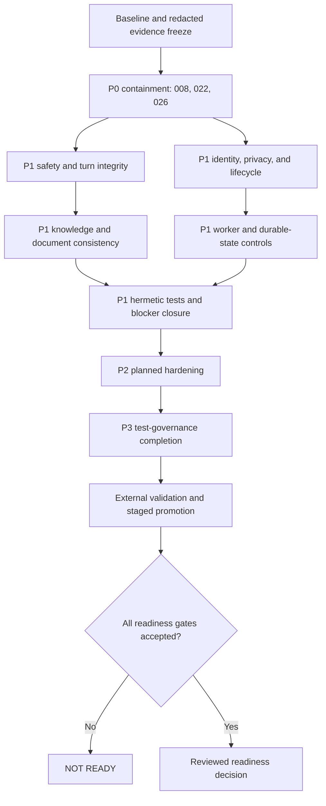

# Resolve Audit Findings Bugfix Design

## Overview

This design defines a staged, fail-closed remediation for audit run `audit-20260827T102557885287Z-073047a3`. It covers ISSUE-001 through ISSUE-040, the six preserved `tests/test_pipeline.py` product failures, the 42-test `tests/test_hardening.py` timeout cohort, and unresolved validation Properties 4, 5, and 9. The authoritative requirements are `.kiro/specs/resolve-audit-findings/bugfix.md`; `issue.md` supplies defect evidence and `solution.md` supplies the approved one-to-one remediation direction.

The implementation strategy is deliberately incremental. It does not combine safety, identity, persistence, document, deployment, and test-governance changes into one unsafe rewrite. Each change unit has explicit prerequisites, a compatibility window where needed, acceptance evidence, and a rollback boundary. A later stage cannot be promoted when a prerequisite stage is incomplete or when evidence is inconclusive.

The design preserves valid behavior, owner scoping, request idempotency, deterministic crisis handling for explicit acute risk, relevant knowledge retrieval, supported document restrictions, safe UI rendering, and SQLite/Mongo semantic parity. Safety, security, and privacy strengthening is permitted only where a numbered requirement requires it. Availability never overrides an unproven mental-health, authorization, privacy, or integrity decision.

No implementation is performed in this phase. The design must not read or expose `.env`, user conversations, runtime database values, credentials, identity tokens, provider payloads, or other sensitive content. Tests and acceptance artifacts use synthetic markers and redacted metadata only.

### Design Goals

- Close all 45 defined bug conditions with one traceable, reviewable remediation path per condition.
- Establish deterministic pre-model, post-model, commit, storage, and deployment boundaries.
- Make schema, token, document identity, cache, encryption, retention, and deletion changes versioned and reversible.
- Preserve behavioral parity between SQLite and Mongo for authoritative turns, safety state, lifecycle, and deletion.
- Support either proven shared coordination or an explicit measured single-worker containment mode.
- Produce hermetic, complete, fresh test evidence and deterministic readiness accounting.
- Keep final readiness `not-ready` until every mandatory repository and external gate has accepted evidence.

### Non-Goals

- Implementing application, infrastructure, migration, or Git-history changes in this phase.
- Treating automated tests as a substitute for qualified mental-health safety, security/privacy, incident, legal, or infrastructure review.
- Accessing live providers, production deployments, protected databases, repository clones, backups, or emergency services.
- Claiming platform encryption, provider privacy, locale-resource currency, edge headers, backup/restore, monitoring, or Mongo topology from repository evidence alone.

### Staged Dependency Gates



| Gate | Mandatory evidence | Failure action |
|---|---|---|
| G0 Baseline | current synthetic reproductions; schema/path/topology inventory; redacted evidence; rollback owner | stop; do not mutate persistent state |
| G1 P0 containment | fail-closed output review; production auth preflight; tracked runtime database containment plan and metadata-only evidence | remain `not-ready`; no public release |
| G2 P1 safety/identity/data | targeted tests, safety/security review, migration dry-runs, backend parity, rollback rehearsal | stop dependent document/distributed work |
| G3 P1 distributed and test controls | worker convergence or enforced single-worker containment; hermetic path attestation; all 48 blockers terminal | stop P2/P3 promotion |
| G4 P2/P3 hardening | migration/restore, headers, supply chain, lifecycle, health, manifest and deployment-gate evidence | retain disposition and residual risk; no production promotion |
| G5 External validation | provider, infrastructure encryption, locale resources, edge, Mongo, monitoring, backup/restore and capacity evidence | remain `not-ready` |
| G6 Final readiness | all P0/P1 closed; Properties 4, 5, 9 pass; exact integrity/output gates; qualified approvals | deterministic `not-ready` with blockers |

## Glossary

- **Bug_Condition (C)**: The union of trigger/control-gap predicates `C-001` through `C-045` defined by requirements 1.1 through 1.45.
- **Property (P)**: A desired invariant over the fixed system `F'`; all numbered properties are defined only in the Correctness Properties section.
- **Preservation**: Observable equivalence between original `F` and fixed `F'` for inputs outside the affected bug condition, except explicit safety, security, privacy, integrity, and operability strengthening.
- **Authoritative_Turn**: The user message, final validated assistant response, request-id record, route, and safety state committed through `ChatArchive.record_turn` or `ChatArchiveMongo.record_turn`.
- **Safety_State_Transaction**: A staged risk assessment and analyzer-counter update that becomes visible only with a successful Authoritative_Turn commit.
- **Minimum_Context**: The smallest authorized, redacted subset of current input, history, memory, summary, and knowledge needed for a specific model operation.
- **Trust_Tier**: A deterministic classification attached to current user input, authoritative turns, derived summaries, memory, and retrieved knowledge before context assembly.
- **Document_ID**: A canonical, root-bounded, case-aware relative path or immutable identifier; never a basename-only key.
- **Cache_Generation**: A monotonically versioned, checksummed knowledge snapshot committed with unique staging and inter-process serialization.
- **Typed_No_Result**: A retrieval result that explicitly states that no relevant knowledge was found and carries no unrelated sections.
- **Derived_Data**: Summaries, memories, profiles, feedback, inferred safety state, and caches derived from authoritative input.
- **Deletion_Job**: A durable idempotent workflow with per-store checkpoints, retries, residual-state verification, and a completion receipt.
- **Token_v2**: A signed identity token containing version, issued-at, expiry, key identifier, and revocation/session epoch claims.
- **Production_Mode**: A public/shared deployment mode in which separate user and administrator authorization, stable identity, secure cookies, privacy controls, and fail-closed startup are mandatory.
- **Hermetic_Test_Root**: A unique temporary root to which every writable and read-sensitive path is redirected before application import.
- **Terminal_Classification**: Exactly one of pass, product-failure, environment-failure, inconclusive, or skipped-ineligible, plus an allowed native test status.
- **Qualified_Safety_Review**: Review by an accountable mental-health safety reviewer of crisis calibration, therapeutic boundaries, cumulative risk, dependency, and vulnerable-user harms.
- **External_Validation**: Evidence that cannot be inferred from repository state, including provider, edge, encryption, resource-directory, backup, restore, monitoring, capacity, and live Mongo controls.
- **Fail_Closed_Readiness**: A readiness decision that remains `not-ready` whenever mandatory evidence, integrity, review, migration, blocker, or external-validation gates are absent or inconclusive.

## Bug Details

### Bug Condition

Let `D = {001, 002, ..., 045}` and let `C-i(X)` be the trigger or missing-control predicate in requirement `1.i`. The aggregate bug condition is:

`C(X) = ⋃ { C-i(X) | i ∈ D }`, equivalently `C(X) = C-001(X) ∨ ... ∨ C-045(X)`.

The bug manifests whenever an applicable request, message, output, record, token, document operation, process event, test, validation record, or release candidate satisfies at least one `C-i` and the original system lacks the corresponding requirement 2.i behavior.

**Formal Specification:**

```text
FUNCTION isBugCondition(input)
  INPUT: input of type Request | Message | ModelOutput | SafetyState |
         DocumentOperation | RetrievalQuery | PersistentRecord | IdentityToken |
         LifecycleEvent | TestEvent | ValidationRecord | ReleaseCandidate
  OUTPUT: boolean

  matchedConditions := EMPTY_SET
  FOR EACH conditionId IN [001..045] DO
    IF triggerPredicate(conditionId, input) = true
       AND originalSystemViolates(requiredBehavior(conditionId), input) = true THEN
      ADD conditionId TO matchedConditions
    END IF
  END FOR

  RETURN matchedConditions IS NOT EMPTY
END FUNCTION
```

### Bug Surface and Affected Interfaces

| Condition | Trigger and current defect | Exact affected components/interfaces |
|---|---|---|
| C-001 | normalized input exceeds 4,000 characters and is silently sliced | `app.utils.clean_message`; `ChatbotService.handle`; `main.chat`; `main.chat_stream` |
| C-002 | safety/analyzer state mutates before failed authoritative commit | `ChatbotService.handle`, `_analyze`, `_ensure_context_loaded`, `_record_turn`; `ConversationRiskReasoner.assess`; `ContextCache.set_safety_state/get_counters`; archive `record_turn` |
| C-003 | injection-class input reaches model with privileged context | `Guardrails.is_injection`; `ChatbotService._respond`, `_build_prompt`, `_generate`; `build_model_input`; `LLMClient.generate` |
| C-004 | filesystem and index operations partially succeed or target basename duplicates | `main.upload_document`, `main.delete_document`; `CAGEngine.refresh_documents`; `KnowledgeCache.refresh`, `remove_document`, `save` |
| C-005 | CLI uses shared service/storage outside a trusted local boundary | `main.run_cli`; `ChatbotService.handle`; settings/storage factory |
| C-006 | negated, quoted, historical, or third-party language trips self-risk floor | `Guardrails.decide`, `assess_safety_level`; `ConversationRiskReasoner.assess`; `ChatbotService._respond`; `CrisisHandler` |
| C-007 | semantic risk failure loses implicit/cumulative trajectory | `ConversationRiskReasoner.assess`, `_signals`, `_fuse`; `ChatbotService._analyze`; `ContextCache.safety_state` |
| C-008 | output reviewer is disabled/fails and deterministic wall misses harm classes | `ResponseBuilder.apply_output_safety`, `_semantic_output_category`; `Guardrails.classify_output`; `render.yaml` safety configuration |
| C-009 | unsafe/stale/contradictory summary is persisted and reused | `ChatbotService._refresh_summary`, `_build_prompt`, `_persist_safety_state`; `ContextCache.summary/set_summary`; archive safety-state methods |
| C-010 | one emergency number is used without verified locale applicability | `CrisisHandler.respond`; `ResponseBuilder.helpline_reply`, `enforce_helpline_number`; `Settings.emergency_number`; deployment resource configuration |
| C-011 | dependency, coercion, diagnosis, and false authority lack deterministic output enforcement | `build_instructions`; `ResponseBuilder.apply_output_safety`; `Guardrails.classify_output`; `ChatbotService._finalize_reply` |
| C-012 | same basenames collapse into one cache key | `KnowledgeCache._scan`, `refresh`, `documents`; document APIs |
| C-013 | lexical miss injects arbitrary leading/full sections | `KnowledgeCache.search_sections`, `build_context`; `CAGEngine.lookup`; `ChatbotService._lookup`; prompt builder |
| C-014 | concurrent writers share one `.tmp` cache filename | `KnowledgeCache.save`, `refresh`, `load`; two-worker deployment topology |
| C-015 | memory/summary/history/knowledge rely on prompt labels for containment | `ChatbotService._cross_session_context`, `_build_prompt`; `LongTermMemory*.retrieve`; `KnowledgeCache.build_context`; `build_model_input` |
| C-016 | internal source metadata is absent from user-visible support contract | `CachedSection.rendered`; `CAGLookup`; `ChatbotService._generate`; response/result serialization |
| C-017 | sensitive records have no enforced age expiry | `ChatArchive*`; `LongTermMemory*`; `ContextCache` summary state; `FeedbackStore*`; retention worker |
| C-018 | session deletion leaves unattributed legacy memory | `main.delete_session`; `LongTermMemory*.forget_session`; archive `delete_conversation`; quarantine/reconciliation store |
| C-019 | account deletion partially progresses across stores | `main.delete_account`; archive `delete_user`; memory `forget_user`; `FeedbackStore*.delete_user`; deletion-job store |
| C-020 | readable sensitive fields lack repository-enforced protection | SQLite/Mongo archive, memory, feedback, profile and derived-state serializers; key provider/envelope codec |
| C-021 | schema/index change or restore has no versioned migration/recovery contract | `ChatArchive._initialize`; `ChatArchiveMongo._ensure_indexes`; feedback/memory initialization; migration runner and release gate |
| C-022 | public/production startup accepts missing user/admin auth | `Settings.validate_storage` and proposed deployment validation; `ApiAuth`; `main._guard_request`; document routes; `render.yaml` |
| C-023 | discarded identities obtain fresh limiter buckets | `IdentityManager.from_request/issue`; `main._client_identity`, `_guard_request`; limiter backend |
| C-024 | stale non-empty limiter buckets are never globally aged | `RateLimiter.check`, `_hits`; shared limiter implementation |
| C-025 | identity token has no time, key, or revocation claims | `IdentityManager._build`, `verify`, `from_request`; cookie issuance; revocation store |
| C-026 | runtime archive database is tracked in Git/history | `data/chat_archive.sqlite3`; `.git` metadata/history; `.gitignore`; incident/clone/backup handling |
| C-027 | browser responses lack explicit security headers | Flask `after_request`; `ui/index.html`; edge/deployment configuration |
| C-028 | sensitive context crosses provider boundary without enforced privacy controls | `ChatbotService._build_prompt`; `ConversationRiskReasoner._semantic_call`; `ResponseBuilder`; `LLMClient`; consent/redaction policy |
| C-029 | default tests resolve live/repository paths | test bootstrap/conftest; `Settings.from_env`; `tests/test_api.py`, `test_hardening.py`, `test_spec_compliance.py`; path guard |
| C-030 | resilience test patches `record`, while runtime calls `record_turn` | `tests/test_security.py::ResilienceTests.test_archive_failure_degrades_gracefully`; `ChatbotService._record_turn`; archive `record_turn` |
| C-031 | safety scenario families are missing from systematic regressions | `tests/test_reasoning_safety.py`, `test_upgrades.py`, `test_spec_compliance.py`, `test_legacy_parity.py`; scenario manifest |
| C-032 | live/destructive contracts lack contained substitutes | `tests/test_mongo_integration.py`; `tests/smoke_live.py`; `tests/smoke_staging.py`; fake-provider/backend harnesses |
| C-033 | test entry points and historical output have no authoritative manifest | `pytest.ini`; `test_all.py`; `test_audit.py`; `context_audit.py`; smoke scripts; manifest runner |
| C-034 | process-local locks, safety, cache, rate, and invalidation diverge across workers | `main` singletons; `ChatbotService._turn_lock`; `ContextCache`; `ResponseCache`; `RateLimiter`; `KnowledgeCache`; `render.yaml` |
| C-035 | mounted `data/` excludes active `knowledge/` and `cache/` | `Settings.knowledge_path`; CAG cache path construction; `render.yaml` disk; startup reconciliation |
| C-036 | clients/connections lack explicit idempotent shutdown | `mongo_client.get_mongo_db/reset_mongo`; `FeedbackStore.close`; archive `close`; app/Gunicorn lifecycle hooks |
| C-037 | dependencies are version-pinned but not artifact/hash locked | `requirements.txt`; deployment build command; lock/SBOM/provenance verifier |
| C-038 | `/health` constructs the service and contacts storage | `main.health`, `get_service`, `_warm_on_import`; archive `healthcheck`; proposed liveness/readiness state |
| C-039 | SLO, alert, budget, capacity, recovery, and incident controls are absent | deployment configuration; metrics/logging; budget/backpressure controller; operational runbooks and drill records |
| C-040 | main branch auto-deploys rebuilt artifacts without promotion gates | `render.yaml` branch/autoDeploy/build; CI acceptance manifest; artifact provenance and rollout controller |
| C-041 | six pipeline assertions fail for knowledge, grounding, price, and instruction filtering | `tests/test_pipeline.py` specified cases; `Settings.from_env`; `build_chatbot`; `KnowledgeCache`; prompt input builder |
| C-042 | 42 hardening tests time out as one batch without per-test outcomes | `tests/test_hardening.py`; authoritative test manifest; isolated partition runner and ledger |
| C-043 | created-output allowlist case-folds exact deliverable paths | prior audit Property 4 validator; canonical case-aware path policy; link/root boundary checks |
| C-044 | complete test-ledger ordering/accounting validation was interrupted | prior audit Property 5 validator; ledger schema; event-state machine; retained run output |
| C-045 | readiness generator marks a conditional record without conditions as expected-valid | prior audit Property 9 generator/validator; readiness schema; counterexample corpus |

### Examples

- A 4,050-character synthetic message with an acute-risk marker at character 4,020 is currently analyzed without the marker; the fixed boundary rejects the entire message before analysis/persistence or applies an explicitly approved complete segmentation policy.
- An archive `record_turn` failure after risk assessment must leave a retry on the same service indistinguishable from a fresh service with no committed turn.
- A prompt-injection message with synthetic memory and knowledge markers must never cause those markers to be sent to `LLMClient.generate`.
- `knowledge/policies/guide.md` and `knowledge/services/guide.md` must retain separate identities; deleting one must not affect the other.
- A disjoint query against a non-empty cache must return `Typed_No_Result`, not the first cached sections.
- A generated reply that says the assistant is the user's only needed support must be replaced even when semantic review times out.
- A Token_v2 verified after `exp`, under an unknown `kid`, or below the user's revocation epoch must be rejected.
- Repeated anonymous requests that discard every identity token must still consume a bounded pre-identity allowance.
- A session deletion containing a synthetic legacy memory without source provenance must quarantine it from retrieval and report an incomplete/reconciled state rather than claim full deletion.
- A conditionally-ready generated record with no pre-production condition must fail readiness validation; alternate-case `Issue.md` must fail the exact output allowlist.
- Each of the 42 hardening tests must receive its own terminal ledger record; a parent batch timeout cannot mark any child as passed or product-failed.

## Expected Behavior

### Preservation Requirements

**Unchanged Behaviors:**

- Messages within the supported bound continue to be normalized and processed in full.
- Successful authoritative turns retain request-id idempotency, owner scoping, ordering, and durable safety continuity.
- Explicit current self-directed acute risk retains deterministic urgent support; contextual calibration must not lower that floor.
- Benign and non-crisis distress continues to receive supportive, non-diagnostic, non-coercive responses.
- Relevant authorized recent history, memory, summary, and knowledge remain available under minimum-context and trust-tier rules.
- Unique supported documents continue to ingest, refresh, list, retrieve, and delete with existing file-type and size restrictions.
- Relevant retrieval remains ranked and bounded; only true no-result behavior changes.
- Existing owner-authorized in-retention data remains readable for its documented purpose during staged migrations.
- Completed session/account deletion remains irreversible and idempotent.
- Constant-time secret comparison, strong random pseudonymous IDs, safe cookie attributes, owner checks, and bounded errors remain in force.
- UI chat rendering via safe text insertion, intended public endpoints, and sanitized exception responses remain unchanged.
- SQLite and Mongo continue to satisfy one shared archive/memory/feedback contract; backend differences must be explicit and tested.
- Tests remain network-denied, synthetic, non-watch, bounded, and unable to read `.env`, live services, or tracked runtime data.
- Failed stages stop dependent work, retain redacted evidence, and roll back only to a known-safe state.

**Scope:**

All inputs for which no `C-i` applies must remain observationally equivalent between `F` and `F'`, except explicit controls that globally strengthen safety, authorization, privacy, data integrity, test isolation, or operability. Preservation comparison covers user-visible results, route/safety classifications, authoritative records, source identity, backend outcomes, error classes, and allowed telemetry—not internal implementation details.

**Expected-Behavior Specification:**

```text
FUNCTION expectedBehavior(input, fixedResult, originalResult)
  INPUT: input, fixedResult from F'(input), originalResult from F(input)
  OUTPUT: boolean

  conditions := matchedBugConditions(input)

  IF conditions IS NOT EMPTY THEN
    FOR EACH conditionId IN conditions DO
      IF NOT satisfiesRequirement("2." + conditionId, fixedResult) THEN
        RETURN false
      END IF
    END FOR
    RETURN allPrerequisiteGatesAccepted(conditions)
           AND noSensitiveValueExposed(fixedResult)
           AND backendContractPreserved(fixedResult)
  END IF

  RETURN observablyEquivalent(originalResult, fixedResult)
         OR explicitlyRequiredStrengthening(input, originalResult, fixedResult)
END FUNCTION
```

## Hypothesized Root Cause

The audit evidence supports the following root-cause families. Exploration tests must confirm each cause before the related implementation unit is accepted; a refuted cause requires a new hypothesis and design update.

1. **Boundary validation occurs too late or is optional** (001, 003, 005, 008, 011, 015, 022, 027, 028, 038)
   - Input is truncated inside normalization rather than accepted/rejected at the request boundary.
   - Injection, therapeutic safety, authentication, privacy, and health checks rely on optional configuration, prompt instructions, or permissive fallback.

2. **Mutable state is not aligned with the authoritative transaction** (002, 009, 019, 034, 036)
   - Process-local safety/counter state changes before `record_turn` commits.
   - Derived state and deletion span stores without durable workflow checkpoints.
   - Ownership and shutdown of shared resources are implicit.

3. **Contextual mental-health semantics are under-specified** (006, 007, 010, 011, 031)
   - Keyword floors do not fully model subject, negation, quotation, tense, uncertainty, locale, or cumulative trajectory.
   - Final-output harm categories and scenario coverage are incomplete.

4. **Document and retrieval identity contracts are too weak** (004, 012, 013, 014, 016, 035, 041)
   - Basenames stand in for stable identity, file/index changes are not transactional, and cache writers share staging state.
   - Retrieval conflates no-match with arbitrary fallback and user-visible answers lack stable provenance.
   - Test construction depends on ambient repository knowledge paths.

5. **Sensitive-data lifecycle lacks an explicit control plane** (017, 018, 020, 021, 026, 028)
   - Retention, provenance, encryption envelopes, migrations, incident containment, provider minimization, and external assurances are not represented as enforceable state.

6. **Identity and abuse state is incomplete or process-local** (023, 024, 025, 034)
   - Principal issuance precedes a stable pre-identity budget.
   - Limiter cleanup does not age idle buckets globally.
   - Token validity is signature-only and lacks expiry, key, and revocation claims.

7. **Deployment assumes a topology that runtime state cannot safely support** (014, 034, 035, 036, 038, 039, 040)
   - Two workers share storage but not locks, rate, safety, cache, or invalidation state.
   - Active paths, lifecycle hooks, liveness/readiness, SLOs, and artifact promotion are not coherently declared.

8. **Test evidence is ambient, fragmented, or incorrectly generated** (029, 030, 031, 032, 033, 041, 042, 043, 044, 045)
   - Test paths and discovery are not universally sandboxed/accounted.
   - One test patches the wrong boundary; a large cohort is not individually bounded.
   - Property validators/generators do not enforce exact case, total ordering, or conditional-readiness preconditions.

## Correctness Properties

Property 1: Bug Condition - Complete Audit Remediation

_For any_ input, operation, lifecycle event, test event, validation record, or release candidate where one or more bug conditions `C-001` through `C-045` hold, the fixed system SHALL satisfy every corresponding requirement 2.i, all prerequisite dependency gates, backend parity, and sensitive-value non-exposure before that condition is considered remediated.

**Validates: Requirements 2.1, 2.2, 2.3, 2.4, 2.5, 2.6, 2.7, 2.8, 2.9, 2.10, 2.11, 2.12, 2.13, 2.14, 2.15, 2.16, 2.17, 2.18, 2.19, 2.20, 2.21, 2.22, 2.23, 2.24, 2.25, 2.26, 2.27, 2.28, 2.29, 2.30, 2.31, 2.32, 2.33, 2.34, 2.35, 2.36, 2.37, 2.38, 2.39, 2.40, 2.41, 2.42, 2.43, 2.44, 2.45**

Property 2: Preservation - Valid Behavior and Backend Parity

_For any_ input where the aggregate bug condition does NOT hold, the fixed system SHALL produce the same authorized user-visible and durable result as the original system, preserving valid message handling, safety floors, idempotency, owner scoping, relevant retrieval, document restrictions, deletion semantics, secure rendering, and SQLite/Mongo outcome parity except for explicitly required safety, security, privacy, integrity, or operability strengthening.

**Validates: Requirements 3.1, 3.2, 3.3, 3.4, 3.5, 3.6, 3.7, 3.8, 3.9, 3.10, 3.11, 3.12, 3.13, 3.14, 3.15, 3.16, 3.17, 3.18, 3.19, 3.20, 3.21, 3.22, 3.23, 3.24, 3.25, 3.26, 3.27, 3.28, 3.29, 3.30, 3.31, 3.32**

Property 3: Input, Safety, and Turn Atomicity

_For any_ message and turn state, oversized content SHALL be handled without silent partial processing; injection-class inputs SHALL not expose privileged context; contextual and cumulative risk SHALL select a reviewed deterministic floor; harmful output SHALL be blocked under reviewer absence/failure; and no uncommitted risk, analyzer, summary, memory, or response state SHALL influence a retry after authoritative commit failure.

**Validates: Requirements 2.1, 2.2, 2.3, 2.6, 2.7, 2.8, 2.9, 2.10, 2.11**

Property 4: Exact Created-Output Allowlist

_For any_ generated path, only the exact case-aware permitted root deliverables and root-bounded active-run findings descendants SHALL be accepted; alternate case, traversal, prefix-only, sibling, link-escape, and pre-existing-file matches SHALL be rejected.

**Validates: Requirements 2.43, 3.26**

Property 5: Test Eligibility and Execution Accounting Are Total and Ordered

_For any_ discovered test set and execution event sequence, every test SHALL receive exactly one pre-execution eligibility decision, every executing eligible test SHALL have a prior passing isolation attestation and exactly one allowed terminal classification, every ineligible test SHALL remain unexecuted with a reason, the six pipeline assertions SHALL pass without weakened expectations, each of the 42 hardening tests SHALL be individually bounded, and the commit-failure test SHALL invoke `record_turn` and prove rollback/retry behavior.

**Validates: Requirements 2.29, 2.30, 2.31, 2.32, 2.33, 2.41, 2.42, 2.44**

Property 6: Document Identity, Retrieval, and Cache Consistency

_For any_ root-bounded document set, query, lifecycle failure point, and concurrent cache schedule, every document SHALL have one stable non-colliding identity, filesystem and index state SHALL converge, committed cache generations SHALL be valid and serializable, relevant matches SHALL retain support/provenance, and a lexical miss SHALL contain no unrelated section.

**Validates: Requirements 2.4, 2.12, 2.13, 2.14, 2.15, 2.16, 2.35, 2.41**

Property 7: Data Lifecycle, Migration, and Deletion Completion

_For any_ supported backend, sensitive record class, record age, schema version, encryption key version, and injected deletion failure, only approved in-retention encrypted data SHALL remain retrievable; ambiguous legacy data SHALL be quarantined; migrations and rollback SHALL reconcile; and deletion SHALL issue a completion receipt only after every required store verifies absence.

**Validates: Requirements 2.17, 2.18, 2.19, 2.20, 2.21, 2.26, 3.11, 3.12, 3.13, 3.14, 3.15**

Property 8: Authentication, Token, and Abuse Boundaries

_For any_ deployment mode, credential configuration, identity-token claims, revocation epoch, clock value, anonymous identity-churn sequence, and limiter key set, public startup SHALL require separate valid user/admin controls; expired, revoked, unknown-key, or malformed tokens SHALL fail; and total allowance and limiter memory SHALL remain bounded across workers.

**Validates: Requirements 2.22, 2.23, 2.24, 2.25, 3.16**

Property 9: Readiness Gating Is Deterministic and Fail-Closed

_For any_ readiness record, `ready` SHALL require no unresolved P0/P1 blockers and all mandatory gates; `conditionally-ready` SHALL require at least one explicit pre-production condition and verification gate; integrity failure or missing mandatory evidence SHALL yield `not-ready`; and `not-ready` SHALL retain blockers and reconsideration evidence.

**Validates: Requirements 2.45, 3.27, 3.29, 3.30, 3.31**

Property 10: Privacy-Minimized External Processing

_For any_ provider-bound operation and classified context set, external processing SHALL occur only when notice/consent and provider controls are accepted, SHALL contain only minimum authorized redacted context, SHALL emit content-free audit metadata, and SHALL be disabled when required controls are unverified.

**Validates: Requirements 2.28, 3.18, 3.25, 3.26, 3.32**

Property 11: Worker Coordination and Durable Runtime State

_For any_ concurrent same-session turns, rate checks, document changes, worker restarts, cache writes, and shutdown sequence, the enabled topology SHALL provide shared coordination and convergent state, or SHALL reject scale-out and enforce measured single-worker semantics; liveness SHALL remain side-effect-free and close hooks SHALL be idempotent.

**Validates: Requirements 2.14, 2.34, 2.35, 2.36, 2.38, 3.21, 3.22**

Property 12: Hermetic Test Isolation

_For any_ default test invocation, every writable or read-sensitive path SHALL resolve beneath a unique Hermetic_Test_Root before application import, live `.env` and protected data SHALL remain unread, outbound egress SHALL remain denied, child processes SHALL be bounded, and the live repository SHALL remain unchanged.

**Validates: Requirements 2.29, 2.32, 3.19, 3.32**

Property 13: Security Headers, Supply Chain, and Artifact Promotion

_For any_ browser response and release candidate, the reviewed header baseline SHALL be present without unsafe UI regression, dependencies SHALL resolve from a reviewed hash-locked provenance set with an SBOM, and only an immutable artifact that passed test, safety, security, privacy, schema, migration, canary, and rollback gates SHALL be promotable.

**Validates: Requirements 2.27, 2.37, 2.40, 3.17, 3.23**

Property 14: Operational Budgets and Safe Degradation

_For any_ generated load, dependency failure, capacity threshold, backup/restore drill, or incident state, reviewed SLOs, budgets, backpressure, alerts, recovery ownership, and safe degraded behavior SHALL prevent unbounded cost/resource use and SHALL never permit unproven mental-health output for availability.

**Validates: Requirements 2.39, 3.8, 3.29, 3.31**

Property 15: Review-Gated Mental-Health Changes

_For any_ change affecting crisis classification, therapeutic output, summaries, memory, locale resources, or external context, promotion SHALL require the complete synthetic scenario matrix plus qualified review of false negatives, false positives, over/under-escalation, cumulative harm, dependency, diagnosis, delusion, privacy, and boundary harms.

**Validates: Requirements 2.6, 2.7, 2.8, 2.9, 2.10, 2.11, 2.31, 3.6, 3.7, 3.9, 3.24**

Property 16: Stage Ordering and Separately Reviewable Changes

_For any_ remediation plan or stage transition, P0 containment SHALL precede dependent P1 work, P1 acceptance SHALL precede P2, P2/test foundations SHALL precede P3/final readiness, and changes sharing a boundary SHALL remain separately reviewable with explicit prerequisites, integration gates, migration evidence, and safe rollback.

**Validates: Requirements 3.23, 3.27, 3.28, 3.29**

## Fix Implementation

### Target Architecture

The fixed architecture adds deterministic policy and transaction boundaries around the existing service rather than replacing its public API all at once.

```mermaid
flowchart LR
    REQ[HTTP or trusted CLI request] --> PRE[Deployment/Auth/Size/Consent preflight]
    PRE --> LIM[Shared or bounded pre-identity limiter]
    LIM --> LOAD[Authoritative history and state load]
    LOAD --> STAGE[Staged risk and analyzer transaction]
    STAGE --> ROUTE{Deterministic route}
    ROUTE -->|Injection| MIN[Refusal or authorized least-context path]
    ROUTE -->|Crisis| CRISIS[Reviewed contextual crisis handler]
    ROUTE -->|Support| CTX[Trust-tiered minimum-context assembler]
    CTX --> RET[Typed retrieval with provenance]
    RET --> MODEL[Privacy-approved model boundary]
    MODEL --> WALL[Deterministic harm wall + fail-closed reviewer]
    MIN --> WALL
    CRISIS --> WALL
    WALL --> COMMIT[Atomic authoritative turn + staged safety state]
    COMMIT --> DERIVED[Idempotent derived-data jobs]
    COMMIT --> RESP[Response]
    DERIVED --> LIFE[Retention/deletion/reconciliation workers]
```



### Core Interface Changes

The names below are design contracts. Existing methods remain adapters during migration so public routes and backend parity can be preserved.

```python
@dataclass(frozen=True)
class ValidatedMessage:
    text: str
    original_chars: int
    policy: Literal["accepted", "rejected", "segmented"]

class MessageBoundary:
    def validate(raw: str, limit: int) -> ValidatedMessage: ...

@dataclass(frozen=True)
class StagedSafetyState:
    base_version: int
    assessment: dict
    counters: dict
    summary_ref: str | None

class TurnCoordinator:
    def begin(user_id: str, session_id: str, request_id: str) -> TurnLease: ...
    def stage_safety(lease: TurnLease, state: StagedSafetyState) -> None: ...
    def commit_turn(lease: TurnLease, turn: AuthoritativeTurn) -> StoredTurn: ...
    def rollback(lease: TurnLease) -> None: ...

@dataclass(frozen=True)
class DocumentIdentity:
    document_id: str              # immutable ID or canonical relative path
    relative_path: str            # root-bounded, case-aware canonical form
    content_hash: str

@dataclass(frozen=True)
class RetrievalResult:
    status: Literal["supported", "no_result", "unavailable"]
    context: str
    sources: tuple[SourceRef, ...]
    cache_generation: int

class DocumentRepository:
    def stage_upload(stream, relative_path: str) -> StagedDocument: ...
    def commit(staged: StagedDocument, expected_generation: int) -> DocumentIdentity: ...
    def delete(document_id: str, expected_generation: int) -> DocumentReceipt: ...
    def recover(operation_id: str) -> DocumentReceipt: ...

class KnowledgeSnapshotStore:
    def load_committed() -> KnowledgeSnapshot: ...
    def compare_and_swap(expected_generation: int, snapshot: KnowledgeSnapshot) -> int: ...

@dataclass(frozen=True)
class SummaryRecord:
    summary_id: str
    user_id: str
    session_id: str
    source_message_ids: tuple[str, ...]
    policy_version: str
    created_at: float
    expires_at: float
    status: Literal["valid", "quarantined", "superseded"]
    text_envelope: EncryptedField

class ContextPolicy:
    def classify(source: ContextSource) -> TrustTier: ...
    def authorize(source: ContextSource, operation: str) -> bool: ...
    def assemble(request: ContextRequest) -> MinimumContext: ...

class IdentityManagerV2:
    def issue(principal: Principal, now: int, ttl: int, kid: str, epoch: int) -> str: ...
    def verify(token: str, now: int, keyring: Keyring, revocations: RevocationStore) -> Principal: ...

class RateLimitStore:
    def check(scope: LimitScope, key_digest: str, cost: int, now: float) -> LimitDecision: ...
    def evict_expired(now: float, max_keys: int) -> EvictionReport: ...

class DeletionWorkflow:
    def start(user_id: str, scope: DeletionScope) -> DeletionJob: ...
    def advance(job_id: str) -> DeletionJob: ...
    def verify(job_id: str) -> DeletionReceipt | ResidualState: ...

class MigrationRunner:
    def plan(current: SchemaVersion, target: SchemaVersion) -> MigrationPlan: ...
    def dry_run(plan: MigrationPlan, synthetic_snapshot) -> ReconciliationReport: ...
    def apply(plan: MigrationPlan) -> ReconciliationReport: ...
    def rollback(plan: MigrationPlan) -> ReconciliationReport: ...
```

### Staged Remediation Matrix

| Unit | Required implementation change | Migration and rollback boundary |
|---|---|---|
| ISSUE-008 / P0 | Add deterministic therapeutic-harm categories to `Guardrails.classify_output`/`ResponseBuilder`; make unavailable, malformed, disabled, or timed-out review return safe replacement, never `safe`; enable reviewed production policy | no data migration; version output-policy configuration; rollback only to a previously accepted fail-closed policy, never current permissive behavior |
| ISSUE-022 / P0 | Add explicit deployment mode validation before app construction; require non-empty separate user/admin controls in production; remove admin fallback; preserve local-development mode only when non-public and isolated | configuration migration with startup dry-run; rollback may restore service availability only after equivalent auth exists |
| ISSUE-026 / P0 | stop tracking runtime DB, block tracked runtime paths, restrict access, preserve metadata-only incident evidence, assess history/clones/backups, rotate affected credentials/identifiers where reviewed | never open/reproduce records for migration evidence; history rewrite is separately approved and irreversible for collaborators; rollback cannot re-track or redistribute data |
| ISSUE-001 | move size decision before `clean_message`; return bounded 4xx rejection stating no content was processed unless a separately reviewed segmentation mode is enabled | update old truncation tests; no persistent migration; rollback only to full rejection, not silent slicing |
| ISSUE-002 | make risk/counters request-local until `record_turn`; store state with authoritative turn; explicitly reset absent contexts; clear staged state on every failure | add state version; migrate persisted state lazily; stale local state is discarded and rehydrated; rollback reads old state but never restores uncommitted state |
| ISSUE-003 | route injection to deterministic refusal or explicit least-context generation before `_lookup`/`_build_prompt`; omit history, cross-session, summary, memory, and knowledge by default | no data rewrite; policy-versioned rollout; rollback remains least-context |
| ISSUE-004 | stage upload under unique operation ID; build candidate snapshot; atomically commit document manifest/cache; delete by document ID; use recovery journal and compensating cleanup | migrate basename operations to IDs; collision inventory/quarantine; rollback keeps old manifest read-only until reconciliation |
| ISSUE-005 | add explicit trusted-local CLI mode, refuse production/shared paths otherwise, and apply authorization/abuse/storage isolation contract | configuration-only; local compatibility adapter; fail closed if trust proof absent |
| ISSUE-006 | add deterministic subject/negation/quotation/temporal parser and ambiguity disposition; route uncertain context to calm clarification; retain acute self-directed floor | version safety policy and reviewed scenario corpus; rollback only to last qualified policy |
| ISSUE-007 | persist compact trajectory/uncertainty state and implement deterministic cumulative fallback; redacted component-failure telemetry | safety-state schema version and dual-read; recompute from authoritative recent turns when migration uncertain |
| ISSUE-009 | store summaries as versioned untrusted records with source IDs, policy, age, correction/status; validate before persistence/reuse; fallback to authoritative turns | existing summaries default to quarantined until validation; rollback ignores new summary rather than trusting legacy text |
| ISSUE-010 | represent resource entries by locale, verification time, reviewer, and expiry; unknown/unverified locale uses neutral wording | migrate single number to an unverified candidate, not globally applicable truth; rollback uses neutral wording |
| ISSUE-011 | extend deterministic output taxonomy and multi-turn dependency indicators; block/rewrite exclusivity, coercion, diagnosis, treatment authority, and care replacement | policy-versioned; retain reviewed false-positive corpus; safe replacement is rollback floor |
| ISSUE-012 | replace basename keys in `_scan`, hashes, metadata, sections, APIs, and cache serialization with `Document_ID` | cache schema v2 migration; detect canonical/case collisions; quarantine ambiguity; never merge silently |
| ISSUE-013 | make `search_sections/build_context/CAGLookup` return typed status; no-result carries no context and forces uncertainty contract | adapter maps old tuple to typed result during transition; rollback preserves no-result semantics |
| ISSUE-014 | write unique staging files, fsync, checksum, generation/CAS, and inter-process lock or concurrency-safe store | cache generations are disposable/rebuildable; invalid/legacy cache is quarantined then rebuilt; rollback to prior verified generation |
| ISSUE-015 | attach trust/provenance to every context source; scan instruction-like text; structurally separate channels; authorize minimum context outside prompts | existing derived data defaults to lower trust; no destructive rewrite required; excluded data remains stored subject to retention |
| ISSUE-016 | propagate source ID, version/hash prefix, freshness, and claim-support metadata through `CAGLookup` and response contract; emit explicit ungrounded uncertainty | add optional response metadata before making it required; no source content exposure; rollback retains uncertainty label |
| ISSUE-017 | define retention by data class; add timestamps/expiry/status and backend workers/TTL-equivalent behavior; emit redacted deletion totals | backfill age from authoritative timestamps where possible; unknown age gets conservative quarantine/review; backup and rollback before expiry cutover |
| ISSUE-018 | migrate deterministic memory provenance; remove ambiguous legacy records from retrieval; include residual/quarantine state in deletion result | no silent delete/retain claim; rollback keeps quarantine closed to retrieval |
| ISSUE-019 | create durable Deletion_Job with per-store checkpoints, retries, residual verification, and signed/redacted receipt | bootstrap jobs for tombstoned partial deletes; idempotent steps; rollback pauses job but does not rehydrate deleted data |
| ISSUE-020 | classify fields and use versioned encryption envelopes with separated key IDs; verify platform encryption/access independently | backup, dual-read/single-encrypted-write, batch re-encrypt, counts/hash reconciliation; rollback to previous key version, never plaintext writes/logs |
| ISSUE-021 | add schema-version ledger, reversible migrations, compatibility matrix, backup/restore drill, and orphan reconciler for archive/memory/feedback | SQLite transaction/backup and Mongo migration collection/index phases; rollback rehearsal required before cutover |
| ISSUE-023 | rate-limit before identity issuance using privacy-preserving trusted-principal/coarse-network digests; add cost budgets | no identity data migration; key digests have short TTL; rollback preserves a bounded pre-identity limit |
| ISSUE-024 | globally age stale buckets, cap cardinality, deterministic eviction, metrics; prefer shared limiter for scale-out | ephemeral limiter state may be reset at deployment under reduced allowance; no raw network identifiers in telemetry |
| ISSUE-025 | issue Token_v2 with `iat`, `exp`, `kid`, epoch; keyring verification and revocation; secure reissue | bounded legacy-v1 acceptance only behind explicit migration window, then reject; rotate keys with overlap; rollback uses prior active key but keeps expiry/revocation |
| ISSUE-027 | add application header middleware for CSP, transport, frame, referrer, MIME and permissions protections; verify edge equivalence | staged report-only CSP then enforcement; compatibility rollback narrows policy but does not remove baseline protections |
| ISSUE-028 | add notice/consent state, field classification/redaction, operation-specific context budgets, provider-control preflight, content-free transmission audit | existing users require applicable notice/consent before external processing; unverified provider state disables path; no payload retention in logs |
| ISSUE-029 | install session-start test bootstrap before app import; ignore `.env`; redirect data/knowledge/cache/home/temp/bytecode; enforce root predicate and egress denial | test-only paths; fail before execution on escape; no live-tree fallback |
| ISSUE-030 | patch archive `record_turn`, assert patch call, no response/secondary state, same-instance/fresh-instance retry equivalence | test-only; preserve other idempotency tests |
| ISSUE-031 | create reviewed machine-readable safety scenario matrix covering all language, trajectory, context, harm, and failure dimensions | corpus is synthetic/redacted and policy-versioned; qualified approval required per changed cell |
| ISSUE-032 | add network-isolated provider contracts and disposable backend/deployment contracts; destructive operations require generated-name allowlist | live suites remain separate/ineligible by default; no production credentials or endpoints |
| ISSUE-033 | create one manifest for pytest, root scripts, audit scripts, smoke and helpers; classify lane, eligibility, command, timeout, owner, freshness | historical outputs marked non-authoritative; manifest reconciliation is additive before retiring old entry points |
| ISSUE-034 | move turn leases, rate state, safety continuity and cache/document invalidation to shared primitives, or set one worker and reject scale-out | topology flag and compatibility gate; single-worker is containment, not distributed completion; rollback returns to measured single worker |
| ISSUE-035 | place knowledge/cache under declared durable root or make cache reconstructable from durable documents; startup generation reconciliation | inventory/copy/checksum/cutover of documents; cache rebuilt; rollback mount/path mapping after reconciliation only |
| ISSUE-036 | register application/Gunicorn lifecycle ownership; drain committed work; close feedback/archive/shared Mongo idempotently | no data migration; repeated close must be safe; rollback keeps process-exit cleanup while hook is corrected |
| ISSUE-037 | generate reviewed transitive hash lock, trusted source policy, SBOM and controlled update workflow; remove opportunistic build upgrade | pin build tool artifacts; rollback uses prior verified lock/artifact set |
| ISSUE-038 | add side-effect-free `/live`; explicit startup initializes service; `/ready` checks bounded preinitialized dependencies and redacts status | deploy probes in order with startup grace; rollback keeps liveness independent even if readiness implementation changes |
| ISSUE-039 | define SLOs, redacted metrics/alerts, cost/disk/connection budgets, backpressure, capacity envelope, backup/restore and incident drills | configuration/runbook versions are promoted with artifact; rollback retains stricter budget and incident ownership |
| ISSUE-040 | disable direct auto-promotion; build immutable artifact once; require test/safety/security/privacy/schema/provenance gates, canary and rollback criteria | source rollback promotes a newly tested immutable artifact; never rebuild unverified dependencies in production |
| C-041 | make pipeline tests construct a hermetic service with explicit synthetic knowledge; fix product retrieval/index/prompt behavior so all six exact assertions pass | preserve assertions and synthetic price/instruction fixtures; do not point tests at repository/live knowledge |
| C-042 | split hardening cohort by test ID or bounded shard; per-test timeout/process tree/output; aggregate only after every child terminal | retain original timeout as environment-failure evidence; no inferred child outcomes |
| C-043 | use exact-case canonical path components, root-relative equality, safe descendant check, and non-followed link policy | retain failing alternate-case counterexample; rerun original and generated path corpus |
| C-044 | enforce ledger state machine and one-to-one discovered-test cover; persist checkpoints and terminal output | interrupted run stays historical/inconclusive; new run receives unique ID and complete retained result |
| C-045 | correct generator so conditional-valid records always include non-empty condition/gate; validator independently rejects omissions | retain minimized old counterexample; rerun with fixed seed plus generated cases; never weaken validator |

### Persistent Data and Schema Plan

All persistent changes use a migration ledger with `migration_id`, `from_version`, `to_version`, checksum, started/completed timestamps, status, reconciliation totals, and rollback reference. No ledger field contains conversation content, secret values, or decrypted data.

1. **Inventory and backup:** enumerate schemas, indexes, record counts, identity/token versions, document paths, cache generations, data classes, derived provenance, and encryption versions using redacted metadata. Create and test a pre-change backup in an authorized isolated environment.
2. **Additive schema:** add nullable/versioned fields before changing readers: retention timestamps/status, encrypted envelopes, summary provenance, deletion jobs/checkpoints, revocation epochs, document IDs, cache generations, and migration metadata.
3. **Dual-read/single-write:** readers accept current and immediately previous supported schema; all new writes use the target version and encryption policy. Legacy ambiguity is quarantined, never guessed.
4. **Backfill:** process bounded batches with idempotent checkpoints. SQLite uses explicit transactions and backup snapshots; Mongo uses majority writes, versioned indexes, and transactions where required.
5. **Reconcile:** compare source/target counts, owner/session associations, checksums of synthetic/ciphertext records, orphan totals, collision totals, and retrieval/deletion behavior on both backends.
6. **Cutover:** make target readers mandatory only after dry-run, restore test, rollback rehearsal, backend contract suite, and accountable approval.
7. **Retire:** remove legacy writers first; remove legacy readers only after the migration window and residual inventory are zero or explicitly quarantined.

#### Backend Parity Contract

| Capability | SQLite implementation | Mongo implementation | Common acceptance |
|---|---|---|---|
| Authoritative turn | one transaction in `record_turn` | replica-set transaction in `record_turn` | exactly one request record and ordered user/assistant messages |
| Staged safety state | same transaction/state version | same transaction/document version | failed turn exposes no staged state |
| Retention | indexed expiry query + bounded worker | reviewed TTL for eligible classes or bounded worker | same eligibility, hold, evidence and user-visible semantics |
| Deletion job | tables + per-store checkpoint rows | collections + checkpoint documents | idempotent retry and receipt only after residual verification |
| Encryption | envelope columns/serialized fields | envelope subdocuments | same algorithm policy, key ID, AAD ownership binding and rotation behavior |
| Migrations | `schema_migrations` transaction and backup | `schema_migrations` collection and phased indexes | dry-run, reconcile, rollback and compatibility evidence |
| Memory provenance | source session/message relation tables | source arrays/documents | attributable delete, ambiguous quarantine, no cross-user retrieval |

### Token and Authorization Migration

Token_v2 payloads contain only pseudonymous IDs and control claims: `{v, u, s, iat, exp, kid, epoch}`. Verification order is structural parse, allowed version, known key, constant-time signature, issued-at skew, expiry, ID shape, user/session epoch, and tombstone. Errors are bounded and never log token bytes or claim values beyond non-sensitive reason codes.

A short, explicit v1 migration window may verify a valid legacy signature and immediately issue v2 only when the user is otherwise authorized and not tombstoned. The window has a fixed end, telemetry count, and kill switch. After it ends, v1 fails. Key rotation overlaps verification keys but signs only with the active key. Revocation increments an epoch; rollback to an older signing key must still consult current expiry and epochs.

`ApiAuth.check_admin` no longer falls back to user auth in production. Document writes require the separate admin boundary. Metrics and administrative diagnostics follow explicit route policy. Local development without API keys is allowed only under an explicit non-public mode with loopback/isolated storage guarantees.

### Document and Cache Migration

Cache schema v2 stores `schema_version`, `generation`, checksum, `Document_ID`, canonical relative path, content hash, source freshness, section IDs stable within the document, and committed timestamp. Migration scans without following unsafe links, rejects root escape and case collisions, and maps old basename entries only when exactly one canonical file matches. Ambiguous entries are quarantined and rebuilt after operator resolution.

Upload writes a unique staged file, validates type/size/root, processes a candidate snapshot, and commits manifest plus cache generation under one coordination lease. Failure removes staging or records a recoverable operation. Delete accepts only `Document_ID`, stages manifest/index removal, unlinks the exact path, and commits the next generation; recovery converges interrupted operations idempotently. Cache state is reconstructable; documents are authoritative.

### Mental-Health Safety Review Boundary

Automated controls may prove routing, state, output-category, failure, and evidence invariants. They cannot establish clinical appropriateness. Qualified safety review is mandatory before promoting any change to `Guardrails`, `ConversationRiskReasoner`, `Analyzer`, `CrisisHandler`, `ResponseBuilder`, summaries, memories, prompts, locale resources, or model-bound context.

The review matrix covers:

- explicit, implicit, ambiguous, negated, quoted, historical, third-party, euphemistic, obfuscated, multilingual and Unicode-sensitive language;
- benign-to-distress, distress-to-acute, acute-to-reassured, topic switch, repeated alternation, stale prior crisis and cross-session carryover;
- deterministic/semantic disagreement and classifier/model/reviewer disabled, timeout, malformed, empty or adversarial behavior;
- diagnosis, treatment certainty, medication instruction, delusion reinforcement, shame, dependency, exclusivity, coercion, authority and replacement-of-care output;
- empathy, calibrated urgency, continued engagement, locale/resource applicability, false negatives, false positives, over-escalation, under-escalation, cumulative and privacy/boundary harm.

Explicit current self-directed acute risk remains the non-negotiable deterministic floor. Ambiguity produces calm clarification or conservative check-in. Unknown locale uses reviewed neutral local-emergency-services wording. No automated pass replaces reviewer sign-off.

### Privacy, Retention, and External Processing Controls

Data classes are current messages, authoritative turns, safety state, summaries, memories/profiles, feedback, identity/revocation, operational metadata, and knowledge. Each class has purpose, minimum fields, retention, legal/incident hold behavior, encryption requirement, deletion scope, provider eligibility, and evidence owner.

Provider calls require an accepted processing policy, minimum-context plan, field-level redaction, verified provider retention/training/region controls, and a content-free audit event containing only operation type, policy version, model identifier, token/character counts, result category, latency and correlation ID. Unverified provider controls disable optional external reasoning/generation; they do not silently send more context. Logs, metrics, test output, receipts, and migration reports never include content, credentials, tokens, decrypted values, or inferred-health details.

### Worker Coordination and Lifecycle

The preferred scale-out design uses shared leases for same-session turns, shared rate/cost state, durable safety state, monotonic document/cache generations, and publish/subscribe invalidation. The exact primitive is deployment-specific and requires disposable multi-worker contract evidence. Until that passes, production configuration enforces one worker and measured capacity; sticky routing alone is not correctness.

Startup is explicit: validate mode/configuration, initialize stores, reconcile migrations/documents/cache, register lifecycle hooks, then mark readiness. `/live` returns process liveness without service construction or external access. `/ready` reads bounded precomputed initialization/dependency state. Shutdown stops readiness, drains accepted work, flushes bounded state, closes feedback/archive/client ownership once, and tolerates repeated hooks.

### Deployment, Supply Chain, and Observability

A release builds one immutable artifact from a reviewed hash-locked transitive set and emits an SBOM and provenance record. Promotion requires the authoritative manifest, hermetic suite, safety/security/privacy approvals, backend migrations and restore evidence, blocker closure, header checks, and external validations. Canary criteria include error rate, latency, safety replacement rate, reviewer-failure rate, auth rejection anomalies, limiter evictions, deletion backlog, cache-generation divergence, disk/connection budgets, and provider cost. Automatic rollback triggers are predefined, but rollback cannot re-enable unsafe output, missing auth, exposed data, invalid tokens, plaintext writes, or incompatible schema.

Observability is content-free. Metrics include counters/histograms for policy category, route, component availability, commit rollback, migration status, cache generation, limiter cardinality/eviction, deletion checkpoint age, readiness reason code, latency and budget use. User IDs, session IDs, raw IPs, tokens, messages, summaries, memory, document text, provider prompts and secrets are excluded or transformed into short-lived approved aggregates.

## Testing Strategy

### Validation Approach

Validation follows four ordered phases: (1) reproduce the original counterexample or control gap using synthetic/redacted inputs; (2) confirm or revise the root-cause hypothesis; (3) check the fixed behavior for every generated input satisfying the bug condition; and (4) differentially check preservation outside the condition. Persistent, safety, identity, and deployment changes additionally require migration, rollback, backend-parity, failure-injection, and accountable review evidence.

No test may load `.env`, contact a live provider/staging endpoint/emergency service, use production credentials, inspect protected database values, or mutate repository-selected runtime paths. Commands are single-run, bounded, and non-watch.

### Exploratory Bug Condition Checking

**Goal:** Surface representative counterexamples on unfixed code without altering application state, then confirm the responsible boundary.

**Test Plan:** Use instrumented fakes and temporary roots to test each `C-i`. Capture only synthetic inputs, method-invocation metadata, reason codes, counts, and redacted outcomes. For future-risk/control-gap findings, prove the missing guard or configuration contract statically and through a synthetic invalid configuration rather than claiming a live incident.

**Representative Counterexamples:**

1. Oversized message suffix omitted by `clean_message`.
2. Same-instance retry differs from fresh instance after `record_turn` failure.
3. Injection reaches fake model with synthetic privileged markers.
4. Duplicate basenames collide and partial document failures diverge.
5. Negated/quoted/historical risk over-escalates; cumulative implicit risk under-escalates on semantic failure.
6. Each therapeutic-harm category survives disabled/failed reviewer.
7. Disjoint retrieval returns unrelated cached content.
8. Token remains valid beyond cookie lifetime and identity churn obtains new buckets.
9. Session/account deletion leaves synthetic residual state after injected store failure.
10. Two workers disagree on locks, rate, cache generation or document visibility.
11. Six pipeline assertions fail and hardening parent batch times out without child outcomes.
12. Alternate-case output path passes; conditional readiness record without conditions is generated as valid.

If an expected counterexample does not reproduce, the implementation task stops for re-hypothesis; the requirement is not weakened to fit the current code.

### Fix Checking

**Goal:** Verify that every input satisfying one or more bug conditions produces the required fixed behavior.

**Pseudocode:**

```text
FOR ALL input WHERE isBugCondition(input) DO
  conditions := matchedBugConditions(input)
  fixedResult := F'(input)
  FOR EACH conditionId IN conditions DO
    ASSERT satisfiesRequirement("2." + conditionId, fixedResult)
  END FOR
  ASSERT expectedBehavior(input, fixedResult, F(input))
END FOR
```

Fix evidence is accepted only when the relevant stage prerequisite, targeted tests, property tests, integration/failure tests, migration reconciliation, backend contract, rollback rehearsal, and required human/external approvals are complete.

### Preservation Checking

**Goal:** Verify that non-buggy behavior remains equivalent except for explicitly required strengthening.

**Pseudocode:**

```text
FOR ALL input WHERE NOT isBugCondition(input) DO
  originalResult := F(input)
  fixedResult := F'(input)
  ASSERT observablyEquivalent(originalResult, fixedResult)
         OR explicitlyRequiredStrengthening(input, originalResult, fixedResult)
END FOR
```

Differential comparison normalizes nondeterministic IDs/timestamps and compares route, safety level, response class, source identity, authoritative state, owner scope, error category, backend result and approved telemetry. It never compares or records live sensitive content.

### Unit Tests

- Boundary tests for empty, exactly-4,000, and over-limit messages with markers on both sides of the boundary.
- `TurnCoordinator` tests for successful commit, every failure point, duplicate request, same/fresh retry, and staged-state cleanup.
- Contextual safety tests for every subject/negation/quotation/tense/ambiguity and explicit-risk floor case.
- Output-wall tests for every therapeutic harm and disabled/timeout/malformed reviewer state.
- Summary validation, quarantine, correction, age and source-provenance tests.
- Locale resource verified/unknown/stale/mismatched tests using synthetic resource records.
- Document canonicalization, case collision, root escape, exact delete, cache checksum/generation and typed no-result tests.
- Context trust-tier and instruction-like-content exclusion tests.
- Token claim, clock skew, expiry, key rotation, epoch revocation, v1 migration-window and bounded-error tests.
- Pre-identity limiting, cardinality cap, global ageing and deterministic eviction tests.
- Retention, encryption-envelope, migration ledger, orphan reconciliation and deletion-job state-machine tests for both backends.
- Security-header, liveness side-effect, readiness bound and idempotent shutdown tests.
- Exact `record_turn` failure patch test and authoritative test-manifest schema/state tests.

### Property-Based Tests

- Generate message sizes/content placements and check all-or-nothing processing.
- Generate turn histories, risk trajectories, semantic/reviewer failures and check safety/atomicity properties.
- Generate canonical paths, case variants, duplicate basenames, traversal, links, cache schedules and crash points.
- Generate query/corpus overlap and verify relevant support or empty typed no-result.
- Generate summary/memory/knowledge trust tiers and instruction-like content; verify minimum authorized context.
- Generate record classes/ages, migration versions, key versions and store failures; verify lifecycle convergence and no plaintext evidence.
- Generate deployment modes, credential combinations, Token_v2 claims, clocks, revocation epochs, one-time identities and limiter load.
- Generate worker operation schedules and verify exactly-once turns, serializable cache generations and convergence.
- Generate resolved test paths/environments and verify Hermetic_Test_Root containment.
- Re-run exact created-output Property 4 with alternate case, traversal, prefix, sibling, link and pre-existing paths.
- Re-run ledger Property 5 with arbitrary discovered sets/events and enforce ordered total accounting.
- Re-run readiness Property 9 with all conclusion/gate combinations and retained minimized conditional-record counterexample.
- Generate remediation stage states and verify prerequisite ordering, stop, rollback and fail-closed readiness.

Every property run records seed, example count, minimized synthetic counterexample, code/artifact identity and terminal result. A failed exploration property is expected before the fix; a failed fix/preservation property blocks promotion.

### Integration Tests

- Full JSON and SSE chat paths through auth, size boundary, safety, model fake, final output wall, authoritative commit and response.
- Same-session concurrent turns and idempotent retries against SQLite and a disposable Mongo-compatible transaction environment.
- Document upload/refresh/retrieve/delete with duplicate names, injected file/index failures, concurrent writers, restart and recovery.
- End-to-end safety scenario matrix with fake moderation, semantic reasoner, generator and output reviewer failure modes.
- Session/account deletion across archive, memory/profile, feedback, summaries, safety state and quarantine with per-store failures.
- Encryption and schema migration dry-run/apply/rollback/restore tests using synthetic snapshots on both backends.
- Multi-worker turn, rate, safety, document/cache invalidation and restart convergence; separately verify enforced single-worker containment.
- Side-effect-free liveness, bounded readiness, explicit startup and repeated graceful shutdown.
- Browser response/header/UI compatibility smoke test using local test client only.
- Offline provider, deployment API and disposable database contracts under egress denial and destructive allowlists.
- Exact six `test_pipeline.py` cases with explicit temporary synthetic knowledge, including price and instruction-data markers.
- All 42 `test_hardening.py` cases as individually bounded tests or small bounded shards, reconciled to exactly 42 terminal records.
- Unified manifest execution covering pytest, root scripts, audits and smoke eligibility, with stale artifacts rejected.
- Immutable artifact promotion simulation with gate failure, canary failure and rollback decision tests.

### Manual and External Acceptance

- Qualified mental-health safety sign-off is required for all safety-policy, crisis, summary, memory, prompt, model-context and locale-resource changes.
- Security/privacy review is required for auth, tokens, abuse controls, encryption, retention, deletion, provider transmission, Git exposure, headers and incident response.
- Data owner review is required for migrations, collision/quarantine handling, backups, restores, orphan reconciliation and deletion receipts.
- Operations review is required for SLOs, alerts, budgets, capacity, topology, shutdown, canary and rollback.
- Independent deployment evidence is required for provider privacy/region/retention, platform and backup encryption, locale-resource currency, edge/TLS/header equivalence, Mongo transaction topology, monitoring/alerts, backup/restore and capacity.

Until all G6 criteria have conclusive accepted evidence, the only valid final state is `not-ready`. Historical pass output, interrupted validation, a batch timeout, inferred external controls, or absence of observed incidents cannot satisfy a gate.
